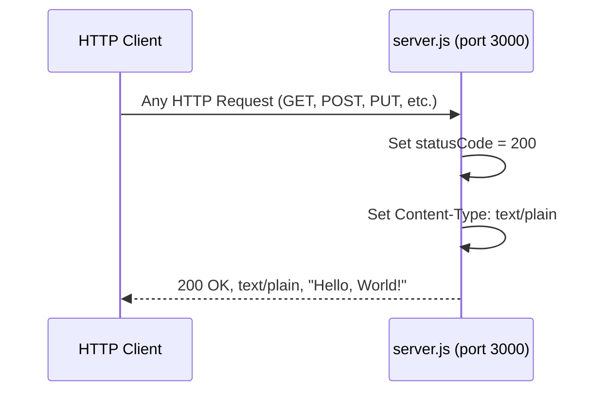
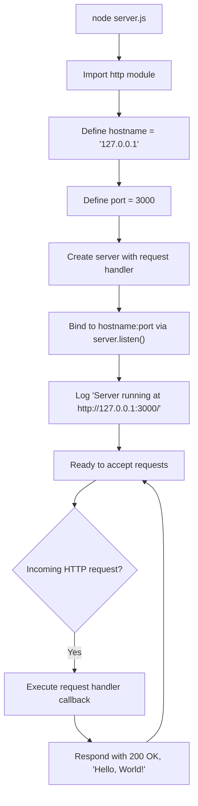

# hello_world

A minimal Node.js HTTP server that responds with "Hello, World!" to every incoming request. This project serves as a backprop integration test fixture for the Blitzy platform.

> **Project name:** `hello_world` (Source: `package.json`, line 2)
> **Description:** Hello world in Node.js (Source: `package.json`, line 4)

---

## Table of Contents

- [Prerequisites](#prerequisites)
- [Installation & Setup](#installation--setup)
- [Usage](#usage)
- [API Documentation](#api-documentation)
- [Code Walkthrough](#code-walkthrough)
- [Diagrams](#diagrams)
- [Deployment Guide](#deployment-guide)
- [Project Structure](#project-structure)
- [Known Issues & Notes](#known-issues--notes)
- [Contributing](#contributing)
- [License](#license)

---

## Prerequisites

| Requirement | Version | Notes |
|-------------|---------|-------|
| **Node.js** | v15+ | Required for npm v7+ compatibility (inferred from `package-lock.json` lockfileVersion 3) |
| **npm** | v7+ | Bundled with Node.js v15+ |

This project has **zero external dependencies** — it uses only the Node.js built-in `http` module (Source: `server.js`, line 12). No additional packages are required.

---

## Installation & Setup

### Clone the Repository

```bash
git clone <repository-url>
cd hello_world
```

### Install Dependencies

```bash
npm install
```

> **Note:** This project has no external dependencies. Running `npm install` ensures `node_modules` directory initialization and lock file consistency.

### Verify Installation

Confirm your Node.js version meets the minimum requirement:

```bash
node -v
```

Expected output: `v15.0.0` or higher.

---

## Usage

### Starting the Server

Start the HTTP server by running `server.js` directly with Node.js:

```bash
node server.js
```

> **Note:** While no explicit `start` script is defined in `package.json` (Source: `package.json`, lines 6–8), `npm start` works by default because npm automatically runs `node server.js` when a `server.js` file is present in the project root. You can also start the server directly with `node server.js`.

### Expected Console Output

```text
Server running at http://127.0.0.1:3000/
```

(Source: `server.js`, line 52)

Once this message appears, the server is ready to accept HTTP requests on `http://127.0.0.1:3000/`.

---

## API Documentation

### Endpoint Overview

The server responds identically to **all HTTP methods** and **all paths** — there is no routing logic. Every request receives the same static response (Source: `server.js`, lines 37–44).

| Method | Path | Status Code | Content-Type | Response Body |
|--------|------|-------------|--------------|---------------|
| ANY | ANY | `200` | `text/plain` | `Hello, World!\n` |

### Request Specification

- **Method:** Any HTTP method is accepted (GET, POST, PUT, DELETE, PATCH, OPTIONS, etc.)
- **Path:** Any path is accepted (`/`, `/foo`, `/bar/baz`, etc.)
- **Headers:** No required headers
- **Query Parameters:** None required
- **Request Body:** Not required (ignored if provided)

### Response Specification

| Field | Value | Source |
|-------|-------|--------|
| **Status Code** | `200 OK` | `server.js`, line 39 |
| **Content-Type** | `text/plain` | `server.js`, line 41 |
| **Body** | `Hello, World!\n` | `server.js`, line 43 |

### Example Request and Response

Send a request to the running server:

```bash
curl -i http://127.0.0.1:3000/
```

Expected output:

```text
HTTP/1.1 200 OK
Content-Type: text/plain
Date: <current date>
Connection: keep-alive
Keep-Alive: timeout=5
Content-Length: 14

Hello, World!
```

---

## Code Walkthrough

The entire application logic resides in `server.js` (14 lines of application code, 53 lines total including JSDoc annotations and inline comments). Below is an annotated walkthrough of each logical block.

### 1. Module Import (line 12)

```javascript
const http = require('http');
```

Imports the Node.js built-in `http` module using CommonJS `require()` syntax. This module provides the functionality to create an HTTP server without any external dependencies (Source: `server.js`, line 12).

### 2. Server Configuration (lines 21–28)

```javascript
const hostname = '127.0.0.1';
const port = 3000;
```

Defines two constants that configure the server's network binding:
- **`hostname`** (`'127.0.0.1'`): The server binds to the localhost loopback address, meaning it only accepts connections from the local machine (Source: `server.js`, line 21).
- **`port`** (`3000`): The TCP port number on which the server listens for incoming HTTP requests (Source: `server.js`, line 28).

### 3. Request Handler (lines 37–44)

```javascript
const server = http.createServer((req, res) => {
  res.statusCode = 200;
  res.setHeader('Content-Type', 'text/plain');
  res.end('Hello, World!\n');
});
```

Creates an HTTP server with a request handler callback that processes every incoming request:
- **`res.statusCode = 200`**: Sets the HTTP response status code to `200 OK` (Source: `server.js`, line 39).
- **`res.setHeader('Content-Type', 'text/plain')`**: Sets the response `Content-Type` header to `text/plain`, indicating a plain text response body (Source: `server.js`, line 41).
- **`res.end('Hello, World!\n')`**: Sends the response body `Hello, World!\n` and signals that the response is complete (Source: `server.js`, line 43).

The `req` parameter (`http.IncomingMessage`) is not inspected — all requests receive the identical response regardless of method, path, or headers.

### 4. Server Startup (lines 50–53)

```javascript
server.listen(port, hostname, () => {
  console.log(`Server running at http://${hostname}:${port}/`);
});
```

Binds the server to the configured `hostname` and `port`, then executes the callback once the server is ready to accept connections. The callback logs the server URL to the console, confirming successful startup (Source: `server.js`, lines 50–53).

---

## Diagrams

### Request-Response Flow



### Server Lifecycle



---

## Deployment Guide

### Local Development

1. Start the server:
   ```bash
   node server.js
   ```
2. Access the server in a browser or with `curl`:
   ```bash
   curl http://127.0.0.1:3000/
   ```
3. Stop the server with `Ctrl+C`.

### Production Deployment

For production environments, consider using a process manager to keep the server running and handle restarts.

#### Using PM2

```bash
# Install PM2 globally
npm install -g pm2

# Start the server with PM2
pm2 start server.js --name hello-world

# View running processes
pm2 list

# Stop the server
pm2 stop hello-world
```

#### Using systemd (Linux)

Create a service file at `/etc/systemd/system/hello-world.service`:

```ini
[Unit]
Description=Hello World Node.js HTTP Server
After=network.target

[Service]
ExecStart=/usr/bin/node /path/to/hello_world/server.js
Restart=always
User=www-data
Environment=NODE_ENV=production

[Install]
WantedBy=multi-user.target
```

Then enable and start:

```bash
sudo systemctl enable hello-world
sudo systemctl start hello-world
```

> **Note:** For production deployments, consider changing the `hostname` in `server.js` from `'127.0.0.1'` to `'0.0.0.0'` to accept connections from external hosts (Source: `server.js`, line 21). Ensure appropriate firewall rules or a reverse proxy (e.g., Nginx) are in place when exposing the server externally.

### Docker Considerations

A Dockerfile is not included in this project (out of scope), but a minimal example for reference:

```dockerfile
FROM node:18-alpine
WORKDIR /app
COPY package*.json ./
RUN npm install --production
COPY server.js .
EXPOSE 3000
CMD ["node", "server.js"]
```

---

## Project Structure

```text
.
├── README.md            # Project documentation
├── package.json         # npm package manifest
├── package-lock.json    # Dependency lock file
└── server.js            # HTTP server entry point
```

| File | Purpose | Key Details |
|------|---------|-------------|
| `README.md` | Project documentation | Comprehensive setup, API, deployment, and code walkthrough documentation |
| `package.json` | npm package manifest | Name: `hello_world`, version: `1.0.0`, license: MIT (Source: `package.json`, lines 2–10) |
| `package-lock.json` | Dependency lock file | lockfileVersion 3, zero external packages |
| `server.js` | HTTP server entry point | 14 lines of application code (53 lines total including JSDoc annotations), uses only Node.js built-in `http` module (Source: `server.js`, lines 1–53) |

---

## Known Issues & Notes

1. **`main` field discrepancy:** `package.json` declares `"main": "index.js"` (Source: `package.json`, line 5) but no `index.js` file exists in the project. The actual application entry point is `server.js`. This discrepancy does not affect server operation since the server is started directly with `node server.js`.

2. **No explicit `npm start` script:** No `start` script is explicitly defined in `package.json` (Source: `package.json`, lines 6–8). However, `npm start` works because npm defaults to running `node server.js` when a `server.js` file exists in the project root. Adding an explicit `"start": "node server.js"` entry to the `scripts` section is optional but can improve clarity for other developers.

3. **Placeholder test script:** Running `npm test` executes `echo "Error: no test specified" && exit 1` — no actual test harness is configured (Source: `package.json`, line 7). A testing framework (e.g., Jest, Mocha) would need to be added for automated testing.

---

## Contributing

This project is a backprop integration test fixture. Contributions should be coordinated with the project maintainer to avoid disrupting test workflows.

To contribute:

1. Fork the repository.
2. Create a feature branch (`git checkout -b feature/your-feature`).
3. Commit your changes (`git commit -m 'Add your feature'`).
4. Push to the branch (`git push origin feature/your-feature`).
5. Open a Pull Request.

---

## License

This project is licensed under the **MIT License** (Source: `package.json`, line 10).
