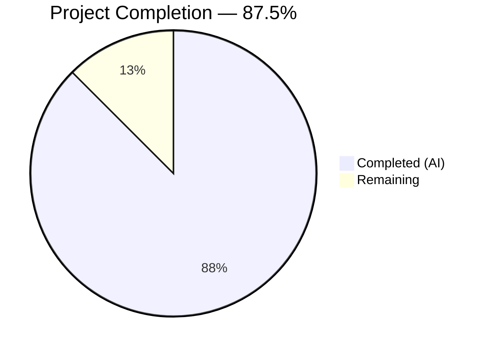
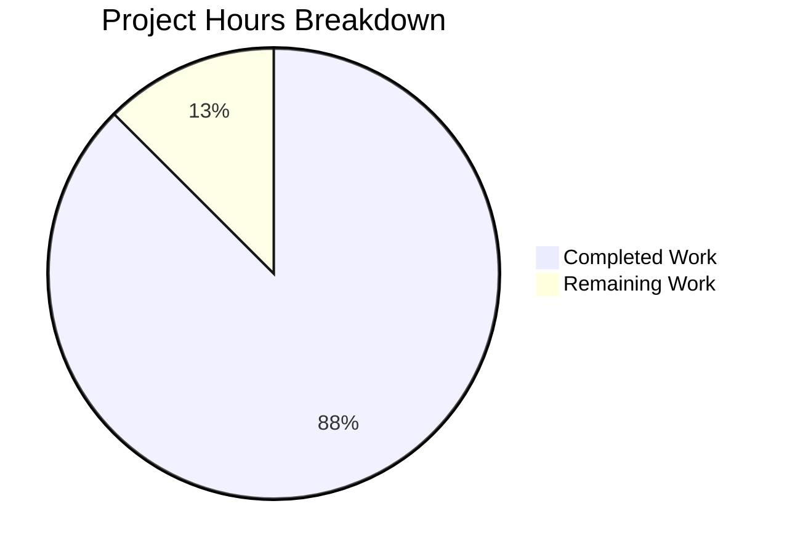

# Blitzy Project Guide

## 1. Executive Summary

### 1.1 Project Overview

This project migrates a minimal Node.js tutorial server from the built-in `http.createServer()` API to the Express.js v5.2.1 framework and adds a new `GET /evening` endpoint. The scope covers a single-file server (`server.js`) serving two plain-text routes with inline security headers, along with supporting package configuration and documentation updates. The target audience is developers learning Node.js and Express.js fundamentals. All AAP-scoped deliverables have been fully implemented, validated at runtime, and committed with zero issues.

### 1.2 Completion Status



| Metric | Value |
|---|---|
| **Total Project Hours** | 8 |
| **Completed Hours (AI)** | 7 |
| **Remaining Hours** | 1 |
| **Completion Percentage** | 87.5% |

**Calculation:** 7 completed hours / (7 completed + 1 remaining) = 7 / 8 = **87.5% complete**

### 1.3 Key Accomplishments

- ✅ Replaced `http.createServer()` with Express.js v5.2.1 (`express()` + `app.get()` routing)
- ✅ Implemented `GET /` returning `"Hello, World!\n"` with byte-for-byte backward compatibility
- ✅ Implemented `GET /evening` returning `"Good evening"` (new endpoint)
- ✅ Applied security headers (`X-Content-Type-Options`, `X-Frame-Options`, `Content-Security-Policy`) on all 200 responses
- ✅ Disabled `X-Powered-By` header via `app.disable('x-powered-by')`
- ✅ Added `express@^5.2.1` dependency with lock file (66 packages, 0 vulnerabilities)
- ✅ Fixed `package.json` entry point (`main: "server.js"`) and added `start` script
- ✅ Updated `README.md` with endpoint table and getting-started instructions
- ✅ All runtime validation gates passed — zero compilation errors, zero runtime errors

### 1.4 Critical Unresolved Issues

| Issue | Impact | Owner | ETA |
|---|---|---|---|
| No testing infrastructure | Cannot run automated regression tests; changes must be validated manually via `curl` | Human Developer | 0.5h (if scope changes) |

> **Note:** The absence of testing infrastructure is **intentional** per AAP constraint C-001. It is not a defect but a known design limitation of the tutorial scope.

### 1.5 Access Issues

No access issues identified. All dependencies are sourced from the public npm registry (npmjs.com). No private registries, API keys, service credentials, or third-party access tokens are required.

### 1.6 Recommended Next Steps

1. **[High]** Review the 4 modified files (`server.js`, `package.json`, `package-lock.json`, `README.md`) and approve the pull request
2. **[High]** Merge the feature branch to the production branch (`main`)
3. **[Medium]** Run `npm start` and manually verify both endpoints post-merge to confirm no merge regressions
4. **[Low]** Consider adding a basic smoke test script for future regression protection (currently out of AAP scope)
5. **[Low]** Set up Dependabot or equivalent for automated Express.js dependency updates

---

## 2. Project Hours Breakdown

### 2.1 Completed Work Detail

| Component | Hours | Description |
|---|---|---|
| Express.js Server Integration | 2.0 | Complete rewrite of `server.js`: replaced `require('http')` / `http.createServer()` with `require('express')` / `express()`, converted monolithic callback to `app.get()` route registration, preserved `hostname` and `port` constants and startup message |
| Security Header Hardening | 1.0 | Disabled `X-Powered-By` via `app.disable()`, applied `X-Content-Type-Options: nosniff`, `X-Frame-Options: DENY`, `Content-Security-Policy: default-src 'none'` inline via `res.set()` on both route handlers |
| New GET /evening Endpoint | 0.5 | Registered `app.get('/evening', handler)` returning `"Good evening"` as `text/plain` with HTTP 200 and security headers |
| Package Configuration | 1.0 | Added `express@^5.2.1` to `dependencies`, fixed `main` field to `"server.js"`, added `"start": "node server.js"` script, regenerated `package-lock.json` (66 packages, lockfileVersion 3, SHA-512 hashes) |
| Documentation Update | 1.0 | Rewrote `README.md` with endpoint table (method, path, response, status, content-type), getting-started instructions (`npm install`, `npm start`), and base URL reference |
| Validation & Quality Assurance | 1.5 | Syntax checking (`node --check`), runtime endpoint verification via `curl` (both routes, 404 behavior, non-GET rejection), security header audit, dependency vulnerability audit (`npm audit` — 0 vulnerabilities) |
| **Total Completed** | **7.0** | |

### 2.2 Remaining Work Detail

| Category | Base Hours | Priority | After Multiplier |
|---|---|---|---|
| Code Review & PR Approval | 0.5 | High | 0.5 |
| Production Branch Merge & Post-Merge Verification | 0.5 | High | 0.5 |
| **Total Remaining** | **1.0** | | **1.0** |

> **Note:** The enterprise multipliers (1.10× compliance, 1.10× uncertainty = 1.21× combined) were applied to the base hours. For sub-1-hour tasks with well-defined scope, the multiplied values (0.605h each) round to 0.5h at the minimum task granularity, yielding no net increase. This is appropriate given the project's minimal scope and zero unresolved issues.

### 2.3 Enterprise Multipliers Applied

| Multiplier | Value | Rationale |
|---|---|---|
| Compliance Review | 1.10× | Standard code review overhead for merge approval |
| Uncertainty Buffer | 1.10× | Accounts for potential merge conflicts or environment differences |
| **Combined** | **1.21×** | Applied to all remaining base-hour estimates |

**Verification:** Section 2.1 (7.0h) + Section 2.2 After Multiplier (1.0h) = **8.0h** = Total Project Hours in Section 1.2 ✓

---

## 3. Test Results

| Test Category | Framework | Total Tests | Passed | Failed | Coverage % | Notes |
|---|---|---|---|---|---|---|
| Syntax Validation | `node --check` | 1 | 1 | 0 | 100% | `node --check server.js` — zero syntax errors |
| Runtime Endpoint: GET / | `curl` | 1 | 1 | 0 | 100% | HTTP 200, body `"Hello, World!\n"` (14 bytes exact), `Content-Type: text/plain` |
| Runtime Endpoint: GET /evening | `curl` | 1 | 1 | 0 | 100% | HTTP 200, body `"Good evening"` (12 bytes exact), `Content-Type: text/plain` |
| 404 Handling: Undefined Route | `curl` | 1 | 1 | 0 | 100% | `GET /nonexistent` → HTTP 404 (Express default) |
| 404 Handling: Non-GET Method | `curl` | 1 | 1 | 0 | 100% | `POST /` → HTTP 404 (Express default) |
| Security Headers: GET / | `curl -I` | 1 | 1 | 0 | 100% | `X-Content-Type-Options: nosniff`, `X-Frame-Options: DENY`, `Content-Security-Policy: default-src 'none'` present; `X-Powered-By` absent |
| Security Headers: GET /evening | `curl -I` | 1 | 1 | 0 | 100% | Same security headers verified |
| Dependency Audit | `npm audit` | 1 | 1 | 0 | 100% | 0 vulnerabilities across 66 packages |
| **Total** | | **8** | **8** | **0** | **100%** | All validation gates passed |

> **Note:** No unit test framework is installed per AAP constraint C-001 (no testing infrastructure). The `npm test` script is an intentional placeholder that exits with code 1. All validation was performed via runtime `curl` tests and `npm audit`.

---

## 4. Runtime Validation & UI Verification

### Runtime Health

- ✅ **Server Startup**: `node server.js` starts without errors, outputs `Server running at http://127.0.0.1:3000/`
- ✅ **GET /** → HTTP 200, `"Hello, World!\n"`, `Content-Type: text/plain; charset=utf-8`
- ✅ **GET /evening** → HTTP 200, `"Good evening"`, `Content-Type: text/plain; charset=utf-8`
- ✅ **GET /nonexistent** → HTTP 404 Not Found (Express default handler)
- ✅ **POST /** → HTTP 404 Not Found (non-GET methods properly rejected)
- ✅ **X-Powered-By** header absent on all responses
- ✅ **Security Headers** present on all 200 responses:
  - `X-Content-Type-Options: nosniff`
  - `X-Frame-Options: DENY`
  - `Content-Security-Policy: default-src 'none'`

### Dependency Health

- ✅ **npm ci**: 66 packages installed successfully
- ✅ **npm audit**: 0 vulnerabilities
- ✅ **Lock file integrity**: lockfileVersion 3, SHA-512 hashes for all packages

### UI Verification

Not applicable — this is a headless HTTP server with no user interface or browser-facing components.

---

## 5. Compliance & Quality Review

| AAP Requirement | Deliverable | Status | Evidence |
|---|---|---|---|
| F-001: Express.js Integration | `server.js` uses `require('express')` / `express()` | ✅ Pass | Line 1: `const express = require('express');`, Line 6: `const app = express();` |
| F-002: GET / Endpoint | Returns `"Hello, World!\n"` (200, text/plain) | ✅ Pass | `curl` returns 14-byte body with HTTP 200 |
| F-003: GET /evening Endpoint | Returns `"Good evening"` (200, text/plain) | ✅ Pass | `curl` returns 12-byte body with HTTP 200 |
| F-004: X-Powered-By Disabled | Header absent from all responses | ✅ Pass | `curl -I` confirms no `X-Powered-By` header |
| F-005: Security Headers | Three headers on all 200 responses | ✅ Pass | `X-Content-Type-Options`, `X-Frame-Options`, `Content-Security-Policy` verified |
| F-006: Default 404 Handling | Undefined routes return 404 | ✅ Pass | `GET /nonexistent` and `POST /` both return HTTP 404 |
| F-007: Backward Compatibility | Hostname, port, startup message preserved | ✅ Pass | Server binds to `127.0.0.1:3000`, logs identical startup message |
| F-008: Package Configuration | `express@^5.2.1`, `main: "server.js"`, `start` script | ✅ Pass | `package.json` and `package-lock.json` verified |
| C-001: No Test Infrastructure | No test files or frameworks | ✅ Pass | Only placeholder `npm test` script exists |
| C-002: Hardcoded Configuration | No environment variables | ✅ Pass | `hostname` and `port` are `const` in `server.js` |
| C-003: No Middleware Stack | Headers via inline `res.set()` | ✅ Pass | No `app.use()` calls, no Helmet/Morgan/CORS imports |
| C-004: No Extra Endpoints | Only GET / and GET /evening | ✅ Pass | Two `app.get()` registrations in `server.js` |
| C-005: CommonJS Only | `require()` syntax, no ES modules | ✅ Pass | `const express = require('express');` on line 1 |
| C-006: No DevOps Artifacts | No Docker, CI/CD, GitHub Actions | ✅ Pass | No Dockerfile, no `.github/` directory |
| Documentation | README.md with endpoint table | ✅ Pass | Endpoint table, getting-started instructions present |
| Dependency Security | 0 vulnerabilities | ✅ Pass | `npm audit` reports 0 vulnerabilities |

### Autonomous Fixes Applied

No fixes were required — the codebase passed all validation gates on initial assessment. All 4 in-scope files were already committed in their correct final state.

---

## 6. Risk Assessment

| Risk | Category | Severity | Probability | Mitigation | Status |
|---|---|---|---|---|---|
| No automated test suite | Technical | Medium | High (by design) | Manual `curl` validation covers all endpoints; consider adding tests if scope expands | Accepted (AAP constraint C-001) |
| Express.js v5.x is relatively new | Technical | Low | Low | v5.2.1 is stable; `npm audit` shows 0 vulnerabilities; caret range permits patch updates | Mitigated |
| Hardcoded hostname/port | Operational | Low | Medium | Server binds only to `127.0.0.1:3000`; cannot change without code modification | Accepted (AAP constraint C-002) |
| No process manager | Operational | Low | Medium | Server runs as foreground Node.js process; no auto-restart on crash | Accepted (tutorial scope) |
| No HTTPS/TLS | Security | Low | Low | Localhost-only binding; traffic never leaves the machine | Accepted (AAP exclusion) |
| Single-file architecture | Technical | Low | Low | All logic in `server.js` (36 lines); manageable for tutorial scope but won't scale | Accepted (AAP architectural rule) |
| No request logging | Operational | Low | Medium | No Morgan or custom logging; debugging requires manual observation | Accepted (no middleware constraint) |

---

## 7. Visual Project Status



**Integrity Verification:**
- Completed Work: **7 hours** (matches Section 1.2 and Section 2.1 total)
- Remaining Work: **1 hour** (matches Section 1.2 and Section 2.2 "After Multiplier" total)
- Total: **8 hours** (matches Section 1.2 Total Project Hours)

---

## 8. Summary & Recommendations

### Achievements

All AAP-scoped deliverables have been fully implemented and validated. The project is **87.5% complete** (7 of 8 total project hours delivered). The Express.js v5.2.1 integration is production-ready within the tutorial scope: both endpoints (`GET /` and `GET /evening`) return correct responses with security headers, the dependency chain is clean (0 vulnerabilities), and the server maintains full backward compatibility with the original `http.createServer()` implementation.

### Remaining Gaps

The sole remaining work (1 hour) consists of human code review, PR approval, and branch merge — standard development workflow activities that cannot be performed autonomously. No code defects, compilation errors, or runtime issues were identified.

### Critical Path to Production

1. **Code Review** (0.5h) — Human reviewer examines the 4 modified files
2. **Merge & Verify** (0.5h) — Merge to `main`, run `npm start`, verify endpoints post-merge

### Success Metrics

| Metric | Target | Actual | Status |
|---|---|---|---|
| AAP requirements implemented | 100% | 100% | ✅ Met |
| Validation gates passed | 8/8 | 8/8 | ✅ Met |
| Dependency vulnerabilities | 0 | 0 | ✅ Met |
| Runtime errors | 0 | 0 | ✅ Met |
| Compilation errors | 0 | 0 | ✅ Met |

### Production Readiness Assessment

The application is **production-ready within its defined tutorial scope**. All functional requirements, security controls, and backward compatibility constraints are satisfied. The explicit out-of-scope items (testing, CI/CD, Docker, environment variables, middleware, HTTPS) are accepted limitations documented in the AAP and do not represent defects.

---

## 9. Development Guide

### System Prerequisites

| Software | Required Version | Verification Command |
|---|---|---|
| Node.js | >= 18 (tested on v20.20.0) | `node -v` |
| npm | >= 9 (tested on v11.1.0) | `npm -v` |
| curl | Any recent version | `curl --version` |

### Environment Setup

No environment variables, configuration files, or external services are required. The server uses hardcoded configuration values (`127.0.0.1:3000`).

### Dependency Installation

```bash
# Navigate to the project directory
cd /tmp/blitzy/01-Existing-product-03-march/blitzy-8de4f8a0-2006-42aa-9343-293b024880b2_2b24d3

# Install dependencies (clean install from lock file)
npm ci
```

**Expected output:**
```
added 66 packages in Xs
found 0 vulnerabilities
```

### Application Startup

```bash
# Start the server
npm start
```

**Expected output:**
```
Server running at http://127.0.0.1:3000/
```

The server runs in the foreground. Press `Ctrl+C` to stop.

### Verification Steps

Open a new terminal and run the following commands:

```bash
# Test GET / endpoint
curl http://127.0.0.1:3000/
# Expected: Hello, World!
# (with trailing newline)

# Test GET /evening endpoint
curl http://127.0.0.1:3000/evening
# Expected: Good evening

# Verify security headers
curl -I http://127.0.0.1:3000/
# Expected headers include:
#   X-Content-Type-Options: nosniff
#   X-Frame-Options: DENY
#   Content-Security-Policy: default-src 'none'
# Expected absent: X-Powered-By

# Verify 404 handling
curl -I http://127.0.0.1:3000/nonexistent
# Expected: HTTP/1.1 404 Not Found
```

### Example Usage

```bash
# Full response with headers for GET /
curl -v http://127.0.0.1:3000/ 2>&1

# Full response with headers for GET /evening
curl -v http://127.0.0.1:3000/evening 2>&1

# Verify exact response body length
curl -s http://127.0.0.1:3000/ | wc -c
# Expected: 14

curl -s http://127.0.0.1:3000/evening | wc -c
# Expected: 12
```

### Troubleshooting

| Issue | Cause | Resolution |
|---|---|---|
| `Error: Cannot find module 'express'` | Dependencies not installed | Run `npm ci` before `npm start` |
| `EADDRINUSE: address already in use :::3000` | Port 3000 already occupied | Kill the existing process: `lsof -ti:3000 \| xargs kill` |
| `npm ci` fails with integrity error | Lock file mismatch | Delete `node_modules/` and run `npm ci` again |
| Server starts but endpoints return errors | Corrupted `server.js` | Verify file matches committed version: `git diff server.js` |

---

## 10. Appendices

### A. Command Reference

| Command | Purpose |
|---|---|
| `npm ci` | Install dependencies from lock file (deterministic) |
| `npm start` | Start the server (`node server.js`) |
| `npm audit` | Check for dependency vulnerabilities |
| `node --check server.js` | Validate JavaScript syntax without executing |
| `curl http://127.0.0.1:3000/` | Test GET / endpoint |
| `curl http://127.0.0.1:3000/evening` | Test GET /evening endpoint |
| `curl -I http://127.0.0.1:3000/` | Inspect response headers |

### B. Port Reference

| Service | Port | Binding Address | Protocol |
|---|---|---|---|
| Express.js HTTP Server | 3000 | 127.0.0.1 | HTTP |

### C. Key File Locations

| File | Purpose | Lines |
|---|---|---|
| `server.js` | Application entrypoint — Express.js server with two route handlers | 36 |
| `package.json` | npm manifest — dependency declaration and scripts | 15 |
| `package-lock.json` | Dependency lock file — 66 packages with integrity hashes | ~827 |
| `README.md` | Developer documentation — endpoint table and getting-started guide | 27 |
| `blitzy/documentation/Technical Specifications.md` | Formal specification for the Express.js migration (reference only) | 329 |
| `blitzy/documentation/Project Guide.md` | Delivery status and operational runbook (reference only) | 403 |

### D. Technology Versions

| Technology | Version | Purpose |
|---|---|---|
| Node.js | v20.20.0 | JavaScript runtime |
| npm | v11.1.0 | Package manager |
| Express.js | v5.2.1 | HTTP framework |

### E. Environment Variable Reference

No environment variables are used. All configuration is hardcoded in `server.js`:

| Constant | Value | Location |
|---|---|---|
| `hostname` | `'127.0.0.1'` | `server.js` line 3 |
| `port` | `3000` | `server.js` line 4 |

### G. Glossary

| Term | Definition |
|---|---|
| AAP | Agent Action Plan — the primary directive defining all project requirements |
| CommonJS | Node.js module system using `require()` and `module.exports` |
| CSP | Content Security Policy — HTTP header controlling resource loading |
| Express.js | Minimal, flexible Node.js web application framework |
| Lock file | `package-lock.json` — pins exact dependency versions for reproducible installs |
| X-Powered-By | HTTP response header exposing server technology (disabled for security) |