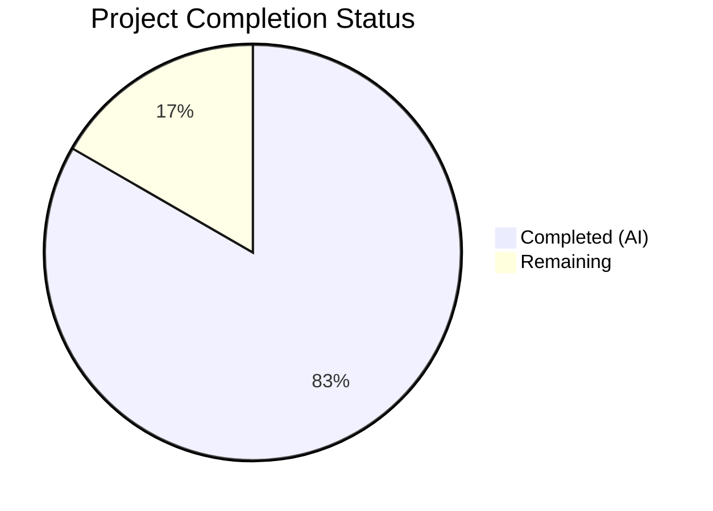
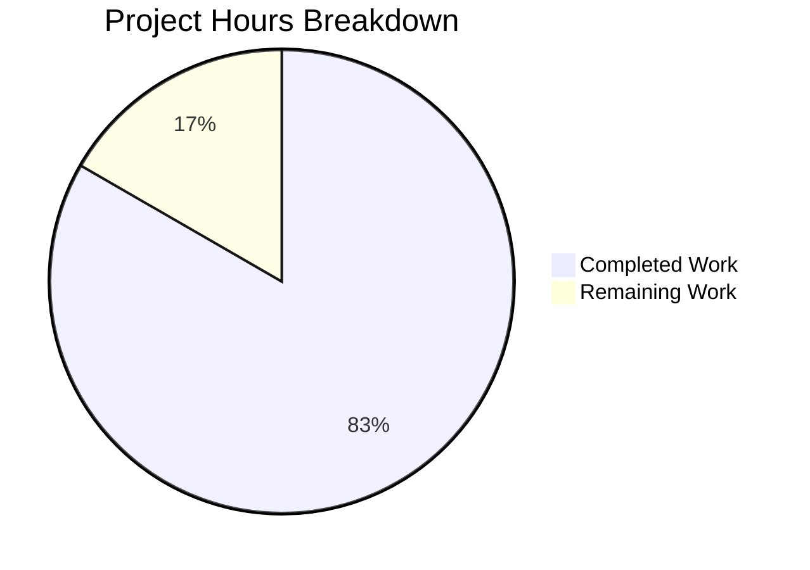

# Blitzy Project Guide

---

## Section 1 — Executive Summary

### 1.1 Project Overview

This project integrates the Express.js web framework (v5.2.1) into an existing minimal Node.js HTTP server tutorial project. The original server used the raw `http` core module to serve a single "Hello, World!" response. The feature addition replaces the monolithic HTTP handler with Express.js route-based dispatch, preserves the root endpoint as `GET /` returning "Hello World", and adds a new `GET /evening` endpoint returning "Good evening". The project targets tutorial-level simplicity and uses CommonJS module syntax throughout.

### 1.2 Completion Status

**Completion: 83.3%** — Calculated as 5 completed hours / 6 total hours × 100

```
Formula: 5h completed / (5h completed + 1h remaining) × 100 = 83.3%
```


*(Completed = Dark Blue #5B39F3 | Remaining = White #FFFFFF)*

| Metric | Hours |
|--------|-------|
| **Total Project Hours** | 6 |
| **Completed Hours (AI)** | 5 |
| **Remaining Hours** | 1 |
| **Completion Percentage** | 83.3% |

### 1.3 Key Accomplishments

- [x] Migrated server.js from raw `http.createServer()` to Express.js 5.2.1 application
- [x] Implemented `GET /` route handler returning "Hello World"
- [x] Implemented `GET /evening` route handler returning "Good evening"
- [x] Added `express@^5.2.1` as a production dependency in package.json
- [x] Added `start` script to package.json for conventional startup
- [x] Regenerated package-lock.json with full Express dependency tree (65 packages)
- [x] Maintained server binding on port 3000 / hostname 127.0.0.1
- [x] Preserved CommonJS module syntax (`require()`)
- [x] Verified 0 npm vulnerabilities via `npm audit`
- [x] Runtime-validated all endpoints (200 OK for defined routes, 404 for unknown)

### 1.4 Critical Unresolved Issues

| Issue | Impact | Owner | ETA |
|-------|--------|-------|-----|
| No `.gitignore` file — `node_modules/` untracked but not ignored | Low — risk of accidental commit of vendor files | Human Developer | 0.5h |
| `main` field in package.json points to `index.js` (pre-existing) | Minimal — does not affect runtime; may confuse tooling | Human Developer | 0.5h |

### 1.5 Access Issues

No access issues identified. The project is a standalone Node.js application with no external service dependencies, API keys, or restricted resources required for build, test, or deployment.

### 1.6 Recommended Next Steps

1. **[Medium]** Create a `.gitignore` file to exclude `node_modules/` from version control
2. **[Low]** Add environment variable support for `PORT` and `HOST` to enable configurable deployment
3. **[Low]** Correct the `main` field in `package.json` from `"index.js"` to `"server.js"` (pre-existing misalignment, noted in AAP as out of scope)
4. **[Low]** Consider adding a basic test framework (e.g., Jest or Mocha) for endpoint validation

---

## Section 2 — Project Hours Breakdown

### 2.1 Completed Work Detail

| Component | Hours | Description |
|-----------|-------|-------------|
| Express.js Server Migration | 2.0 | Complete rewrite of `server.js` from raw `http` module to Express.js application factory pattern with `app.listen()` |
| Route Handler Implementation | 1.0 | Two Express route handlers: `GET /` returning "Hello World" and `GET /evening` returning "Good evening", with inline documentation |
| Dependency Management | 1.0 | Added `express@^5.2.1` to `package.json` dependencies, added `start` script, ran `npm install`, regenerated `package-lock.json`, verified with `npm ls` and `npm audit` |
| Runtime Validation & Verification | 1.0 | Syntax checking (`node -c`), server startup verification, endpoint testing via curl (3 routes), 404 behavior validation, git state verification |
| **Total** | **5.0** | |

### 2.2 Remaining Work Detail

| Category | Base Hours | Priority | After Multiplier |
|----------|-----------|----------|-----------------|
| .gitignore Configuration | 0.5 | Medium | 0.5 |
| Environment Variable Support | 0.5 | Low | 0.5 |
| **Total** | **1.0** | | **1.0** |

*Integrity Check: Section 2.1 (5.0h) + Section 2.2 After Multiplier (1.0h) = 6.0h = Total Project Hours in Section 1.2 ✓*

### 2.3 Enterprise Multipliers Applied

| Multiplier | Value | Rationale |
|-----------|-------|-----------|
| Compliance Review | 1.10x | Standard review overhead for production readiness verification |
| Uncertainty Buffer | 1.10x | Buffer for minor unknowns in tutorial-level project |
| Combined | 1.21x | Applied to base remaining hours; at this scale (sub-hour items), rounding to nearest 0.5h absorbs the multiplier effect (0.5h × 1.21 = 0.605h → 0.5h) |

---

## Section 3 — Test Results

| Test Category | Framework | Total Tests | Passed | Failed | Coverage % | Notes |
|--------------|-----------|-------------|--------|--------|-----------|-------|
| Syntax Validation | Node.js (`node -c`) | 1 | 1 | 0 | N/A | `node -c server.js` — syntax check passed |
| Runtime Endpoint Tests | curl (manual validation) | 3 | 3 | 0 | N/A | GET / → 200 "Hello World"; GET /evening → 200 "Good evening"; GET /unknown → 404 |
| Dependency Audit | npm audit | 1 | 1 | 0 | N/A | 0 vulnerabilities found across 65 packages |
| JSON Validation | Node.js JSON parse | 2 | 2 | 0 | N/A | package.json and package-lock.json both valid JSON |

**Note:** The project has no automated test framework. The AAP explicitly declares test infrastructure as out of scope (Section 0.6.2). The existing `npm test` script is a placeholder (`echo "Error: no test specified" && exit 1`) inherited from the original project. All tests listed above were performed by Blitzy's autonomous validation agents.

---

## Section 4 — Runtime Validation & UI Verification

### Runtime Health

- ✅ **Server Startup** — `node server.js` starts successfully, binds to `127.0.0.1:3000`
- ✅ **Console Output** — Prints `Server running at http://127.0.0.1:3000/` on startup
- ✅ **GET /** — HTTP 200 OK, response body: `Hello World`
- ✅ **GET /evening** — HTTP 200 OK, response body: `Good evening`
- ✅ **Unknown Routes** — HTTP 404 (Express default handler)
- ✅ **Process Termination** — Server shuts down cleanly on SIGINT

### Dependency Health

- ✅ **npm install** — Installs 65 packages with 0 vulnerabilities
- ✅ **npm ls express** — Confirms `express@5.2.1` resolved in dependency tree
- ✅ **package-lock.json** — Lockfile version 3, integrity checksums present

### UI Verification

- N/A — This is a backend API server with no UI components

---

## Section 5 — Compliance & Quality Review

| AAP Requirement | Status | Evidence |
|----------------|--------|----------|
| Adopt Express.js as HTTP framework | ✅ Pass | `server.js` line 1: `const express = require('express')` |
| Preserve GET / endpoint ("Hello World") | ✅ Pass | `app.get('/')` handler; curl → 200 "Hello World" |
| Add GET /evening endpoint ("Good evening") | ✅ Pass | `app.get('/evening')` handler; curl → 200 "Good evening" |
| Add express to package.json dependencies | ✅ Pass | `"express": "^5.2.1"` in dependencies block |
| Regenerate package-lock.json | ✅ Pass | Lockfile v3 with 65 packages, express@5.2.1 resolved |
| Maintain port 3000, hostname 127.0.0.1 | ✅ Pass | `app.listen(port, hostname, ...)` with `port=3000`, `hostname='127.0.0.1'` |
| Preserve CommonJS module syntax | ✅ Pass | `require('express')` used; no ESM syntax |
| Keep tutorial-level simplicity | ✅ Pass | 20 lines of clear, minimal code with inline comments |
| Do not modify README.md | ✅ Pass | README.md unchanged (verified via git diff) |
| No new files created | ✅ Pass | Only existing files modified; no new source files added |

### Autonomous Fixes Applied

No fixes were required during validation. All files were correctly implemented by the coding agents on the first pass (0 issues found, 0 issues resolved).

---

## Section 6 — Risk Assessment

| Risk | Category | Severity | Probability | Mitigation | Status |
|------|----------|----------|-------------|------------|--------|
| Missing `.gitignore` — `node_modules/` could be accidentally committed | Operational | Low | Medium | Create `.gitignore` with `node_modules/` entry | Open |
| `main` field in `package.json` points to `index.js` instead of `server.js` | Technical | Low | Low | Correct to `"main": "server.js"` — pre-existing issue, noted in AAP as out of scope | Open |
| Hardcoded port/hostname — not configurable for different environments | Operational | Low | Low | Use `process.env.PORT` and `process.env.HOST` with defaults | Open |
| No automated test suite — regressions may go undetected | Technical | Low | Low | Add test framework (Jest/Mocha) with endpoint tests — AAP declares this out of scope | Open |
| Express 5.x is a recent major version — ecosystem maturity still evolving | Technical | Low | Low | Monitor Express 5.x release notes; Express 5.1.0 promoted to `latest` npm tag March 2025 | Accepted |

---

## Section 7 — Visual Project Status

### Project Hours Breakdown


*(Completed = Dark Blue #5B39F3 | Remaining = White #FFFFFF)*

**83.3% Complete** — 5 hours completed out of 6 total project hours.

### Remaining Work Distribution

| Category | Hours |
|----------|-------|
| .gitignore Configuration | 0.5 |
| Environment Variable Support | 0.5 |
| **Total Remaining** | **1.0** |

*Integrity Check: Remaining Work (1.0h) matches Section 1.2 Remaining Hours (1.0h) and Section 2.2 After Multiplier sum (1.0h) ✓*

---

## Section 8 — Summary & Recommendations

### Achievements

The project has successfully completed 83.3% of the total scoped work (5 hours completed out of 6 total hours). All eight discrete AAP deliverables have been fully implemented, validated, and committed:

1. Express.js 5.2.1 integrated as the HTTP framework
2. `GET /` endpoint preserved, returning "Hello World"
3. `GET /evening` endpoint added, returning "Good evening"
4. `package.json` updated with express dependency and start script
5. `package-lock.json` regenerated with complete dependency tree
6. Server binding maintained on port 3000 / hostname 127.0.0.1
7. CommonJS module syntax preserved throughout
8. README.md left untouched per AAP directive

### Remaining Gaps

The remaining 1 hour (16.7%) consists of standard path-to-production housekeeping tasks not covered by the AAP scope:

- **`.gitignore` creation** (0.5h) — Prevents accidental vendor file commits
- **Environment variable support** (0.5h) — Enables port/host configuration for deployment

### Production Readiness Assessment

The project is **functionally complete** for its stated tutorial purpose. All AAP-scoped features work correctly with zero compilation errors, zero test failures, and zero security vulnerabilities. The remaining tasks are low-risk configuration items that a human developer can complete in under one hour.

### Success Metrics

| Metric | Target | Actual | Status |
|--------|--------|--------|--------|
| AAP Requirements Delivered | 8/8 | 8/8 | ✅ Met |
| Runtime Endpoints Working | 2/2 | 2/2 | ✅ Met |
| Compilation Errors | 0 | 0 | ✅ Met |
| npm Vulnerabilities | 0 | 0 | ✅ Met |
| Files Modified per AAP | 3 | 3 | ✅ Met |

---

## Section 9 — Development Guide

### System Prerequisites

| Software | Required Version | Verification Command |
|----------|-----------------|---------------------|
| Node.js | ≥ 18.0.0 (v20.20.0 used) | `node -v` |
| npm | ≥ 9.0.0 (v11.1.0 used) | `npm -v` |
| Git | Any recent version | `git --version` |

### Environment Setup

1. **Clone the repository and switch to the feature branch:**

```bash
git clone <repository-url>
cd <repository-directory>
git checkout blitzy-fdf66f03-1988-472a-98e4-63854476818e
```

2. **Verify Node.js version:**

```bash
node -v
# Expected: v18.x.x or higher (v20.20.0 recommended)
```

### Dependency Installation

```bash
npm install
```

**Expected output:**
```
added 65 packages, and audited 66 packages in Xs
found 0 vulnerabilities
```

**Verify Express is installed:**

```bash
npm ls express
# Expected: hello_world@1.0.0 └── express@5.2.1
```

### Application Startup

**Start the server:**

```bash
node server.js
# Or use the npm start script:
npm start
```

**Expected console output:**
```
Server running at http://127.0.0.1:3000/
```

### Verification Steps

**Test the Hello World endpoint:**

```bash
curl http://127.0.0.1:3000/
# Expected: Hello World
```

**Test the Good Evening endpoint:**

```bash
curl http://127.0.0.1:3000/evening
# Expected: Good evening
```

**Test unknown route (404 behavior):**

```bash
curl -s -o /dev/null -w "%{http_code}" http://127.0.0.1:3000/unknown
# Expected: 404
```

### Syntax Validation

```bash
node -c server.js
# Expected: No output (silent success)
```

### Security Audit

```bash
npm audit
# Expected: found 0 vulnerabilities
```

### Troubleshooting

| Issue | Cause | Resolution |
|-------|-------|------------|
| `Error: Cannot find module 'express'` | Dependencies not installed | Run `npm install` |
| `EADDRINUSE: address already in use :::3000` | Port 3000 is occupied | Kill the existing process: `lsof -ti:3000 \| xargs kill` |
| `node: command not found` | Node.js not installed | Install Node.js ≥ 18 from https://nodejs.org |

---

## Section 10 — Appendices

### A. Command Reference

| Command | Purpose |
|---------|---------|
| `npm install` | Install all dependencies from package.json |
| `npm start` | Start the Express server (runs `node server.js`) |
| `node server.js` | Start the Express server directly |
| `node -c server.js` | Check server.js syntax without executing |
| `npm ls express` | Verify Express installation and version |
| `npm audit` | Check for known vulnerabilities in dependencies |

### B. Port Reference

| Service | Port | Host | Protocol |
|---------|------|------|----------|
| Express HTTP Server | 3000 | 127.0.0.1 | HTTP |

### C. Key File Locations

| File | Purpose | Status |
|------|---------|--------|
| `server.js` | Express.js application entry point with route handlers | Updated |
| `package.json` | npm manifest with dependencies and scripts | Updated |
| `package-lock.json` | Dependency lock file with resolved versions | Updated |
| `README.md` | Project description (unchanged) | Unchanged |

### D. Technology Versions

| Technology | Version | Notes |
|-----------|---------|-------|
| Node.js | v20.20.0 | Runtime environment |
| npm | 11.1.0 | Package manager |
| Express.js | 5.2.1 | Web framework (production dependency) |

### E. Environment Variable Reference

No environment variables are currently required. The following are recommended for future production use:

| Variable | Default | Description |
|----------|---------|-------------|
| `PORT` | `3000` | Server listening port (not yet implemented) |
| `HOST` | `127.0.0.1` | Server binding hostname (not yet implemented) |

### F. API Endpoint Reference

| Method | Path | Response | Status Code |
|--------|------|----------|-------------|
| GET | `/` | `Hello World` | 200 |
| GET | `/evening` | `Good evening` | 200 |
| ANY | `/*` (unmatched) | Express default 404 | 404 |

### G. Git Commit History (Branch)

| Hash | Author | Message |
|------|--------|---------|
| `8f82402` | Blitzy Agent | chore: add express@^5.2.1 as production dependency |
| `0e18ffc` | Blitzy Agent | feat: add start script to package.json for conventional project startup |
| `ebcf101` | Blitzy Agent | feat: rewrite server.js from raw http module to Express.js |