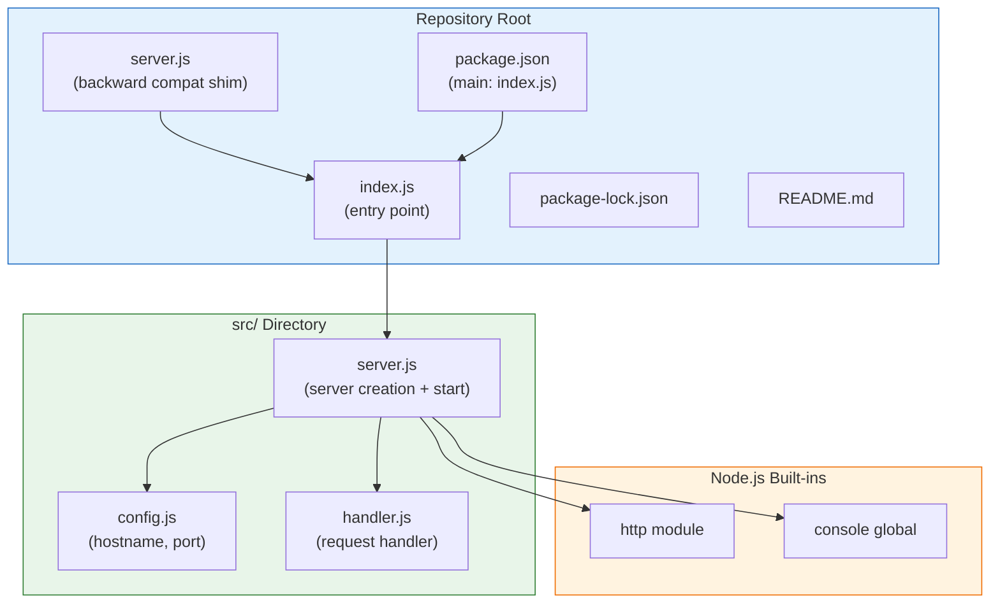

# Technical Specification

# 0. Agent Action Plan

## 0.1 Intent Clarification

### 0.1.1 Core Refactoring Objective

Based on the prompt, the Blitzy platform understands that the refactoring objective is to improve the code structure, organization, and project configuration of the `hao-backprop-test` repository — a minimal "Hello World" Node.js HTTP server that serves as a test fixture for Backprop integration validation. The project currently consists of a single monolithic `server.js` file (14 lines) with zero subdirectories and zero external dependencies, and the refactoring aims to modernize and properly structure this codebase while preserving its core purpose as a deterministic, predictable test fixture.

- **Refactoring Type:** Code structure and modularity improvement
- **Target Repository:** Same repository (in-place refactoring)
- **Refactoring Goals:**
  - Modularize the monolithic `server.js` into well-separated concerns (configuration, server creation, request handling)
  - Fix the `package.json` manifest discrepancies — specifically the `main` field pointing to a non-existent `index.js` instead of the actual entry point `server.js`
  - Add missing npm scripts (`start`, `dev`) for standard project operation
  - Establish a proper project directory structure with distinct modules for configuration, server logic, and application entry point
  - Update `README.md` to accurately reflect the project structure and provide operational instructions

- **Implicit Requirements Surfaced:**
  - The server must continue to bind to `127.0.0.1:3000` and respond with `Hello, World!\n` to every request — behavioral parity is non-negotiable
  - The zero-dependency design principle must be preserved; no external npm packages should be introduced
  - The deterministic, stateless nature of the HTTP response must remain unchanged after refactoring
  - The `package-lock.json` must remain consistent with the zero-dependency architecture
  - The project's role as a Backprop integration test fixture must be maintained throughout the refactoring

### 0.1.2 Technical Interpretation

This refactoring translates to the following technical transformation strategy:

- **Current Architecture:** A flat, single-file monolith where `server.js` handles all responsibilities — configuration declaration, HTTP server creation, request handling, and server startup — within 14 lines of CommonJS JavaScript. The `package.json` contains metadata mismatches (non-existent `index.js` as `main`, no `start` script), and the `README.md` is a minimal warning notice.

- **Target Architecture:** A properly organized Node.js project with separated concerns following standard Node.js conventions:
  - A dedicated configuration module isolating hardcoded values (`hostname`, `port`)
  - A request handler module encapsulating the HTTP response logic
  - A server bootstrap module responsible for creating and starting the HTTP server
  - A corrected `package.json` with accurate entry points and useful npm scripts
  - An updated `README.md` with project structure documentation and usage instructions

- **Transformation Rules:**
  - Extract all configuration constants (`hostname`, `port`) into a dedicated `src/config.js` module
  - Extract the request handler callback into a standalone `src/handler.js` module
  - Create a `src/server.js` module responsible for server creation and startup
  - Create a root `index.js` entry point that wires all modules together
  - Update `package.json` to reference `index.js` as the correct `main` entry and add npm scripts
  - Maintain CommonJS module syntax (`require`/`module.exports`) consistent with the existing codebase pattern

## 0.2 Source Analysis

### 0.2.1 Comprehensive Source File Discovery

The repository contains exactly four files at the root level with zero subdirectories. Every file has been inspected and cataloged below. There are no hidden files (aside from `.git/`), no nested folders, and no additional source files to discover.

**Search Patterns Applied:**
- Root-level file scan: `*` — discovered all 4 files
- Subdirectory scan: `**/` — confirmed zero subdirectories exist
- Legacy/deprecated pattern scan: `**/*legacy*`, `**/*deprecated*`, `**/*old*` — no matches
- Large file detection: files exceeding 500 lines — none found (largest file is 14 lines)
- Tight coupling analysis: files with more than 10 imports — none found (only 1 import total)

### 0.2.2 Current Structure Mapping

```
Current:
(repository root)
├── .git/                  (version control - not in scope)
├── README.md              (2 lines - project identity and warning)
├── package.json           (11 lines - npm manifest with discrepancies)
├── package-lock.json      (13 lines - lockfileVersion 3, zero deps)
└── server.js              (14 lines - monolithic server implementation)
```

### 0.2.3 Source File Inventory

| File | Lines | Responsibility | Refactoring Relevance |
|------|-------|---------------|----------------------|
| `server.js` | 14 | Monolithic HTTP server: imports `http`, declares config constants, creates server with handler, starts listening | Primary refactoring target — to be decomposed into separate config, handler, and server modules |
| `package.json` | 11 | npm manifest declaring `hello_world@1.0.0` with author `hxu`, MIT license | Requires corrections: `main` field points to non-existent `index.js`, no `start` script defined |
| `package-lock.json` | 13 | Deterministic lock state for npm, lockfileVersion 3, zero external packages | Must be regenerated after `package.json` updates to maintain consistency |
| `README.md` | 2 | Contains project title (`hao-backprop-test`) and modification warning | Requires update to document new project structure and usage instructions |

### 0.2.4 Source Code Analysis

**`server.js` — Decomposition Points:**
- Lines 1: Module import (`const http = require('http')`) — stays with server module
- Lines 3–4: Configuration constants (`hostname`, `port`) — extract to config module
- Lines 6–9: Request handler callback — extract to handler module
- Lines 12–14: Server listen call with startup log — stays with server/entry module

**`package.json` — Discrepancies Identified:**
- `main: "index.js"` — file does not exist; must either create `index.js` or update to `server.js`
- `scripts.test` — placeholder that intentionally fails (`echo "Error: no test specified" && exit 1`)
- No `scripts.start` — server must be run directly via `node server.js`
- No `dependencies` or `devDependencies` — intentional zero-dependency design

**`README.md` — Current Content:**
- Line 1: `# hao-backprop-test`
- Line 2: `test project for backprop integration. Do not touch!`
- No structural documentation, no usage instructions, no project description beyond the warning

## 0.3 Scope Boundaries

### 0.3.1 Exhaustively In Scope

**Source Transformations:**
- `server.js` — Primary refactoring target; to be decomposed into modular components under a new `src/` directory
- `src/*.js` — All new JavaScript source modules created during refactoring (config, handler, server)

**Configuration Updates:**
- `package.json` — Fix `main` entry point, add `start` and `dev` scripts, ensure metadata accuracy
- `package-lock.json` — Regenerate to reflect any `package.json` structural changes

**Documentation Updates:**
- `README.md` — Rewrite to document the refactored project structure, usage instructions, and development workflow

**Entry Point Creation:**
- `index.js` — New root-level entry point that wires together all modular components, aligning with the `package.json` `main` field

**Import Corrections:**
- All new `src/*.js` files must use proper CommonJS `require()`/`module.exports` patterns
- The new `index.js` entry point must correctly import from `src/` modules

### 0.3.2 Explicitly Out of Scope

| Exclusion | Rationale |
|-----------|-----------|
| Adding external npm dependencies | The zero-dependency design principle is a core architectural decision that must be preserved |
| Test framework setup | The placeholder test script is intentional; no test framework was requested |
| CI/CD pipeline configuration | No pipeline files exist, and none were requested in the refactoring scope |
| Docker containerization | No containerization was requested; the project remains a local test fixture |
| HTTPS/TLS support | Plain HTTP is sufficient for the Backprop test fixture use case |
| Route handling or middleware | The uniform response behavior (all paths return `Hello, World!\n`) is by design |
| Environment variable configuration | Hardcoded values are intentional for deterministic behavior |
| TypeScript migration | The project uses CommonJS JavaScript, and no language migration was requested |
| `.git/` directory | Version control internals are never modified |
| Production deployment artifacts | This is explicitly a test project, not intended for production use |
| Performance optimization | The 14-line server has no performance concerns to address |
| Authentication or authorization | Not required for a Backprop test fixture |
| Request body parsing or routing | The stateless, uniform response design is preserved |

## 0.4 Target Design

### 0.4.1 Refactored Structure Planning

The target architecture separates the monolithic `server.js` into distinct modules under a `src/` directory, introduces a proper root entry point (`index.js`), and corrects all `package.json` discrepancies. The structure follows standard Node.js project conventions while preserving the zero-dependency, deterministic design.

```
Target:
(repository root)
├── index.js                (new - root entry point, wires modules together)
├── package.json            (updated - corrected main, added scripts)
├── package-lock.json       (regenerated - reflects package.json changes)
├── README.md               (updated - documents new structure and usage)
├── server.js               (updated - simplified to delegate to index.js or retained as legacy compatibility shim)
└── src/
    ├── config.js           (new - extracted configuration constants)
    ├── handler.js          (new - extracted HTTP request handler)
    └── server.js           (new - server creation and startup logic)
```

### 0.4.2 Module Design Details

**`src/config.js` — Configuration Module**
- Exports `hostname` (`'127.0.0.1'`) and `port` (`3000`) as named constants
- Single source of truth for all server configuration values
- Uses `module.exports` for CommonJS compatibility

**`src/handler.js` — Request Handler Module**
- Exports the HTTP request handler function
- Sets `res.statusCode = 200`, `Content-Type: text/plain`, and responds with `Hello, World!\n`
- Encapsulates the complete response logic in a reusable, testable function

**`src/server.js` — Server Module**
- Imports `http` from Node.js built-ins, `config` from `./config.js`, and `handler` from `./handler.js`
- Creates the HTTP server using `http.createServer(handler)`
- Exports a `start` function that calls `server.listen()` with config values
- Emits the startup console log upon successful binding

**`index.js` — Root Entry Point**
- Requires `src/server.js` and invokes the `start` function
- Serves as the canonical entry point referenced by `package.json` `main` field
- Minimal wiring code — delegates all logic to `src/` modules

**`server.js` (root) — Updated**
- Updated to serve as a backward-compatible entry that delegates to `index.js` or directly to `src/server.js`
- Ensures `node server.js` continues to work for existing workflows

### 0.4.3 Design Pattern Applications

- **Separation of Concerns:** Configuration, request handling, and server lifecycle are isolated into dedicated modules, each with a single responsibility
- **Module Pattern (CommonJS):** Each `src/` file exports a focused interface via `module.exports`, enabling clear dependency chains and testability
- **Entry Point Pattern:** A single `index.js` at the root acts as the composition root, wiring together all modules without containing business logic itself

### 0.4.4 Architectural Diagram



## 0.5 Transformation Mapping

### 0.5.1 File-by-File Transformation Plan

The following table provides a comprehensive mapping of every target file to its source, transformation mode, and key changes. Every file in the target structure is accounted for.

| Target File | Transformation | Source File | Key Changes |
|------------|---------------|-------------|-------------|
| `index.js` | CREATE | `server.js` | New root entry point; requires `src/server.js` and invokes the start function; replaces direct inline execution pattern from original `server.js` |
| `src/config.js` | CREATE | `server.js` | Extract `hostname` and `port` constants from `server.js` lines 3–4 into a dedicated configuration module with `module.exports` |
| `src/handler.js` | CREATE | `server.js` | Extract the `http.createServer` callback from `server.js` lines 6–9 into a standalone request handler function exported via `module.exports` |
| `src/server.js` | CREATE | `server.js` | Extract server creation (`http.createServer`) and startup logic (`server.listen`) from `server.js` lines 1, 6, 12–14; imports config and handler modules; exports a `start` function |
| `server.js` | UPDATE | `server.js` | Simplify to a backward-compatible shim that requires and delegates to `index.js` to preserve existing `node server.js` workflows |
| `package.json` | UPDATE | `package.json` | Fix `main` field from `index.js` (now valid since `index.js` will exist), add `scripts.start` (`node index.js`), retain all existing metadata |
| `package-lock.json` | UPDATE | `package-lock.json` | Regenerate via `npm install` after `package.json` changes to maintain deterministic lock state |
| `README.md` | UPDATE | `README.md` | Expand with project description, refactored structure documentation, usage instructions (`npm start`, `node server.js`), and preserved Backprop test fixture context |

### 0.5.2 Cross-File Dependencies

**Import Statement Changes:**

- `src/server.js` requires:
  - `const http = require('http');` (Node.js built-in — unchanged)
  - `const config = require('./config');` (new internal import)
  - `const handler = require('./handler');` (new internal import)

- `src/config.js` requires:
  - No imports — pure data module exporting constants

- `src/handler.js` requires:
  - No imports — pure function module exporting the request handler

- `index.js` requires:
  - `const server = require('./src/server');` (new internal import)

- `server.js` (root, updated) requires:
  - `require('./index');` (delegation to the new entry point)

**Configuration Updates:**
- `package.json` `main` field: `"index.js"` — now resolves correctly to the new root entry point
- `package.json` `scripts.start`: `"node index.js"` — enables standard `npm start` workflow

### 0.5.3 Wildcard Patterns

All file patterns in this refactoring are explicit and specific due to the minimal project size. No trailing wildcard patterns are necessary:

- `src/*.js` — covers all three new source modules (`config.js`, `handler.js`, `server.js`)
- Root `*.js` — covers `index.js` and the updated `server.js`
- Root `*.json` — covers `package.json` and `package-lock.json`
- Root `*.md` — covers `README.md`

### 0.5.4 One-Phase Execution

The entire refactoring is executed in a single phase. All file creations (`index.js`, `src/config.js`, `src/handler.js`, `src/server.js`) and file updates (`server.js`, `package.json`, `package-lock.json`, `README.md`) are performed together as one atomic operation. No multi-phase execution or incremental rollout is planned or required.

## 0.6 Dependency Inventory

### 0.6.1 Key Packages

The project operates under a strict zero-dependency architecture. No external npm packages are declared in `package.json` (neither `dependencies` nor `devDependencies`), and the `package-lock.json` confirms an empty dependency graph with only the root package entry. The refactoring preserves this zero-dependency design.

| Registry | Package Name | Version | Purpose |
|----------|-------------|---------|---------|
| Node.js built-in | `http` | Bundled with Node.js runtime | HTTP server creation via `http.createServer()` — the sole module import in the entire project |
| Node.js built-in | `console` | Bundled with Node.js runtime | Startup log output via `console.log()` |
| npm (root package) | `hello_world` | `1.0.0` | The project itself, declared in `package.json` and `package-lock.json` |

**Runtime Environment:**
- **Node.js:** v15+ minimum (inferred from `package-lock.json` lockfileVersion 3 requiring npm v7+). No explicit version is documented in `.nvmrc`, `engines` field, or CI configuration. Environment verified with Node.js v20.20.1 and npm v11.1.0.
- **npm:** v7+ minimum (required by lockfileVersion 3). No explicit version constraint documented.

### 0.6.2 Dependency Updates

**No external dependency additions or removals are required.** The refactoring is purely structural — reorganizing existing code into modules — and does not introduce any new packages.

**Import Refactoring:**

Files requiring internal import updates:

| File Pattern | Import Change | Details |
|-------------|--------------|---------|
| `src/server.js` | Add `require('./config')` | New internal import to configuration module |
| `src/server.js` | Add `require('./handler')` | New internal import to request handler module |
| `index.js` | Add `require('./src/server')` | New internal import to server module |
| `server.js` (root) | Replace all inline code with `require('./index')` | Delegates to new entry point |

**External Reference Updates:**

| File | Update Type | Details |
|------|-----------|---------|
| `package.json` | Metadata correction | `main` field already points to `index.js` — now valid since the file will be created |
| `package.json` | Script addition | Add `"start": "node index.js"` to `scripts` |
| `package-lock.json` | Regeneration | Run `npm install` to regenerate lock state after `package.json` updates |
| `README.md` | Documentation | Update to reflect new project structure and module organization |

## 0.7 Refactoring Rules

### 0.7.1 Refactoring-Specific Rules

- **Preserve Deterministic Behavior:** The HTTP server must continue to respond with exactly `Hello, World!\n`, status `200`, and `Content-Type: text/plain` to every request on `127.0.0.1:3000`, regardless of HTTP method, path, or headers. Zero behavioral change is acceptable.
- **Maintain Zero-Dependency Architecture:** No external npm packages shall be introduced. The project must continue to rely exclusively on Node.js built-in modules (`http`, `console`).
- **Preserve CommonJS Module System:** All modules must use `require()` for imports and `module.exports` for exports, consistent with the existing codebase pattern. No ES module (`import`/`export`) syntax.
- **Backward Compatibility:** The command `node server.js` must continue to start the server successfully, even after refactoring. This is achieved by updating the root `server.js` to delegate to the new entry point.
- **Maintain Localhost Binding:** The server must continue to bind exclusively to `127.0.0.1` (loopback interface), not `0.0.0.0` or any other interface.

### 0.7.2 Special Instructions and Constraints

- **Test Fixture Identity:** This codebase is a simple "Hello World" Node.js server intended as a test project for integrating with Backprop, a tool or service likely used for code analysis, refactoring, or AI-assisted development. It is clearly marked as a test project and not meant for production use.
- **Immutability Context:** While the original `README.md` states "Do not touch!", the refactoring itself is an authorized structural improvement. The "Do not touch!" directive applies to ad-hoc modifications outside of this planned refactoring scope.
- **No Test Framework Required:** The placeholder test script (`echo "Error: no test specified" && exit 1`) is intentional. No test framework installation or test file creation is required unless explicitly requested.
- **Package Identity Preservation:** The npm package name (`hello_world`), version (`1.0.0`), author (`hxu`), license (`MIT`), and description (`Hello world in Node.js`) must remain unchanged in `package.json`.
- **Lockfile Integrity:** After `package.json` modifications, `package-lock.json` must be regenerated to ensure deterministic install state via `npm ci`.

### 0.7.3 User-Provided Implementation Rules

The following rule was explicitly provided by the user:

- **Rule "QA-16-march-rules":** "This codebase is a simple 'Hello World' Node.js server intended as a test project for integrating with Backprop, a tool or service likely used for code analysis, refactoring, or AI-assisted development. It's clearly marked as a test project and not meant for production use."

## 0.8 References

### 0.8.1 Codebase Files and Folders Searched

The following files and folders were comprehensively searched and analyzed to derive the conclusions in this Agent Action Plan:

| Path | Type | Purpose of Inspection |
|------|------|-----------------------|
| ` ` (repository root) | Folder | Discovered all 4 project files and confirmed zero subdirectories |
| `server.js` | File | Analyzed monolithic server implementation; identified decomposition points (config, handler, server lifecycle) |
| `package.json` | File | Identified metadata discrepancies (`main: index.js` non-existent, missing `start` script), confirmed zero dependencies |
| `package-lock.json` | File | Confirmed lockfileVersion 3, zero external packages, deterministic lock state |
| `README.md` | File | Reviewed project identity (`hao-backprop-test`) and modification warning directive |
| `.git/` | Folder | Confirmed single commit history (`3cb447e Add files via upload`) |

### 0.8.2 Technical Specification Sections Referenced

| Section | Key Information Retrieved |
|---------|--------------------------|
| 1.1 Executive Summary | Project purpose as Backprop integration test fixture, immutability contract, key stakeholders |
| 1.3 Scope | In-scope capabilities, out-of-scope exclusions, notable discrepancies (entry point mismatch, missing start script) |
| 2.1 Feature Catalog | Four features documented: HTTP Server Initialization (F-001), Static HTTP Response (F-002), Console Startup Logging (F-003), Test Fixture Stability (F-004) |
| 3.1 Stack Overview | Technology footprint: Node.js v15+, JavaScript CommonJS, npm v7+, zero frameworks |
| 3.4 Open Source Dependencies | Confirmed zero open source dependencies in both `package.json` and `package-lock.json` |
| 5.1 High-Level Architecture | Monolithic single-file zero-dependency design, architectural principles (determinism, immutability, zero-dependency) |
| 5.2 Component Details | Detailed component analysis of `server.js`, `package.json`, server state model |

### 0.8.3 Attachments

No attachments were provided for this project.

### 0.8.4 External Resources

No Figma URLs, external design documents, or third-party references were provided or required for this refactoring scope.

### 0.8.5 Environment Verification

| Check | Result |
|-------|--------|
| Node.js version | v20.20.1 (satisfies v15+ minimum inferred from lockfileVersion 3) |
| npm version | v11.1.0 (satisfies v7+ minimum required by lockfileVersion 3) |
| `npm ci` | Clean execution — 0 packages audited, 0 vulnerabilities |
| Server startup test | `node server.js` starts successfully on `127.0.0.1:3000` |
| HTTP response test | `curl http://127.0.0.1:3000/` returns `Hello, World!` as expected |
| `.blitzyignore` | No `.blitzyignore` files found in the repository |

