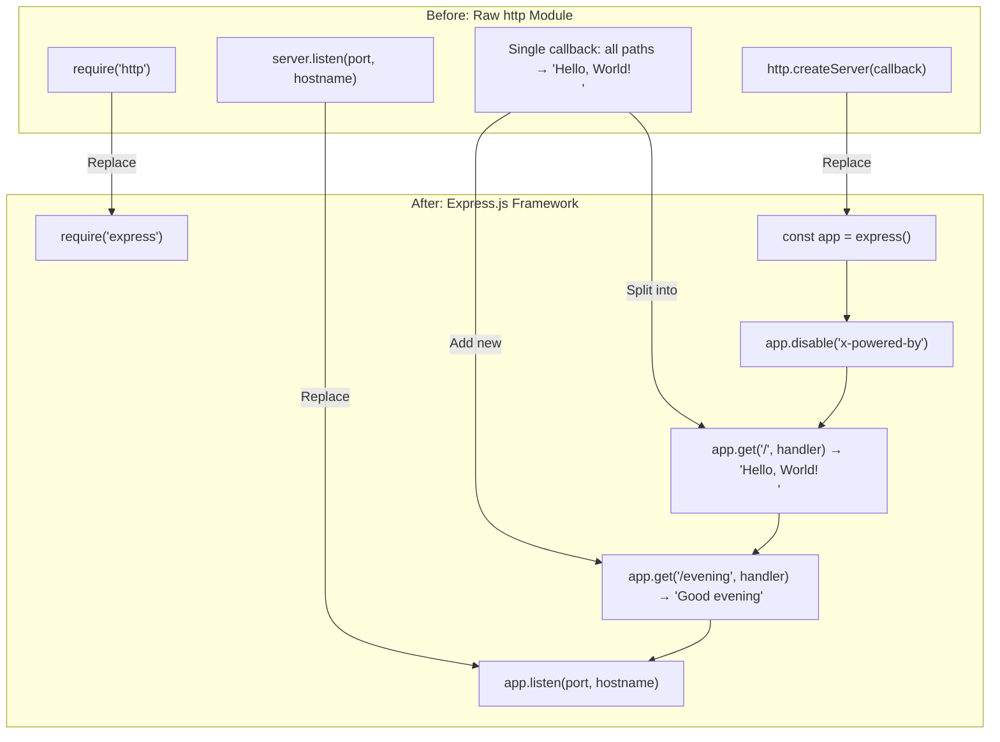

# Technical Specification

# 0. Agent Action Plan

## 0.1 Intent Clarification

### 0.1.1 Core Feature Objective

Based on the prompt, the Blitzy platform understands that the new feature requirement is to:

- **Integrate the Express.js framework** into an existing Node.js tutorial project that currently uses the raw `http.createServer()` API to serve a single endpoint returning `"Hello, World!\n"`. The user wants Express.js to replace the built-in `http` module as the HTTP server foundation.
- **Add a new HTTP endpoint** (`GET /evening`) that returns the plain-text response `"Good evening"` with an HTTP 200 status code, extending the server from a single-route monolith to a multi-route Express.js application.

Implicit requirements detected from the user's request and the existing codebase:

- **Preserve existing behavior**: The original `GET /` endpoint must continue to return exactly `"Hello, World!\n"` (including the trailing newline character) as `text/plain` with HTTP 200 status — maintaining byte-for-byte backward compatibility with the legacy `http.createServer()` implementation.
- **Maintain server binding**: The server must remain bound to `127.0.0.1:3000` with the same startup console message format (`Server running at http://127.0.0.1:3000/`).
- **Security header hardening**: The existing project context (as documented in `blitzy/documentation/Technical Specifications.md`) calls for disabling the Express.js `X-Powered-By` header and applying `X-Content-Type-Options: nosniff`, `X-Frame-Options: DENY`, and `Content-Security-Policy: default-src 'none'` on all successful responses.
- **Default 404 handling**: Express.js's built-in default 404 handler replaces the legacy behavior (which returned `"Hello, World!\n"` for every path and method) with proper HTTP semantics for undefined routes.
- **CommonJS module system**: The project must remain in CommonJS (`require()`) style — no ES module migration.

### 0.1.2 Special Instructions and Constraints

- **Tutorial scope**: The user explicitly describes this as a tutorial project. The implementation must remain simple, educational, and single-file.
- **Maintain backward compatibility**: The `GET /` response body, status code, content type, and server binding must be identical to the original `http.createServer()` implementation.
- **Follow repository conventions**: The project follows a single-file server pattern (`server.js`), CommonJS imports, hardcoded configuration constants, and an MIT license. These conventions must be preserved.
- **No middleware stack**: Per the project's documented constraints (C-003 in `blitzy/documentation/Technical Specifications.md`), no Express.js middleware beyond inline route handlers is permitted — security headers are applied via `res.set()` directly within each handler.
- **No additional infrastructure**: No tests, CI/CD, Docker, environment variables, TypeScript, or additional endpoints beyond those specified.

### 0.1.3 Technical Interpretation

These feature requirements translate to the following technical implementation strategy:

- To **integrate Express.js**, we will modify `server.js` to replace `const http = require('http')` and `http.createServer()` with `const express = require('express')` and `express()`, adopting Express.js's `app.get()` route registration and `app.listen()` server binding patterns.
- To **add the "Good evening" endpoint**, we will create a new `app.get('/evening', handler)` route in `server.js` that responds with the exact string `"Good evening"` as `text/plain` with HTTP 200.
- To **declare Express.js as a dependency**, we will modify `package.json` to add `"express": "^5.2.1"` to the `dependencies` object, fix the `main` field from `index.js` to `server.js`, and add a `start` script (`node server.js`).
- To **regenerate the lock file**, we will run `npm install` to produce a new `package-lock.json` pinning Express.js v5.2.1 and its 65 transitive dependencies.
- To **update documentation**, we will modify `README.md` to reflect both endpoints with their method, path, response, status, and content type in a structured table.

## 0.2 Repository Scope Discovery

### 0.2.1 Comprehensive File Analysis

The repository is a minimal Node.js project with a flat structure containing four source-level files and one documentation subfolder. Every file and folder has been evaluated for relevance to the Express.js integration and new endpoint addition.

**Existing Files Requiring Modification**

| File Path | Current Purpose | Required Changes |
|---|---|---|
| `server.js` | Application entrypoint using `http.createServer()` with a single handler returning `"Hello, World!\n"` to all requests | Refactor to Express.js: replace `require('http')` with `require('express')`, replace `http.createServer()` with `express()`, convert monolithic callback to two `app.get()` route handlers (`GET /` and `GET /evening`), add security headers via `res.set()`, disable `X-Powered-By`, change `server.listen()` to `app.listen()` |
| `package.json` | npm manifest with name `hello_world`, version `1.0.0`, `main: "index.js"`, no dependencies declared | Add `"express": "^5.2.1"` to `dependencies`, fix `main` field from `"index.js"` to `"server.js"`, add `"start": "node server.js"` to scripts, update `description` to reflect both endpoints |
| `package-lock.json` | Lock file (will be regenerated) | Regenerated by `npm install` to pin Express.js v5.2.1 and all 65 transitive dependencies with SHA-512 integrity hashes |
| `README.md` | Basic project description | Update to document both endpoints in a table format, add getting-started instructions (`npm install`, `npm start`), specify base URL `http://127.0.0.1:3000/` |

**Documentation Files (No Modification Required)**

| File Path | Purpose | Impact |
|---|---|---|
| `blitzy/documentation/Technical Specifications.md` | Formal specification and execution plan for the Express migration | Reference document — no modification needed |
| `blitzy/documentation/Project Guide.md` | Delivery status, validation evidence, and operational runbook | Reference document — no modification needed |

**Integration Point Discovery**

| Integration Point | File | Location | Description |
|---|---|---|---|
| HTTP framework import | `server.js` | Line 1 | Change from `require('http')` to `require('express')` |
| Application instantiation | `server.js` | Line 6 | Change from `http.createServer(callback)` to `express()` |
| Route registration | `server.js` | Lines 12–31 | Convert monolithic callback to `app.get('/', handler)` and `app.get('/evening', handler)` |
| Server binding | `server.js` | Lines 33–35 | Change from `server.listen()` to `app.listen()` |
| Dependency declaration | `package.json` | Line 12–14 | Add `dependencies` block with `express` |
| Entry point correction | `package.json` | Line 5 | Fix `main` field to `"server.js"` |

### 0.2.2 Web Search Research Conducted

No external web search was required for this feature addition. The implementation relies on well-established Express.js patterns that are fully documented in the existing tech spec and project documentation. Express.js v5.2.1 is confirmed as the latest stable release per the dependency analysis in the tech spec (§3.2.1), compatible with Node.js >= 18, and the project's Node.js v20.20.0 runtime satisfies this requirement.

### 0.2.3 New File Requirements

No new source files, test files, or configuration files need to be created for this feature. The implementation scope is confined to modifying existing files:

- **No new source files** — The single-file server architecture (`server.js`) is preserved per the tutorial scope constraint. Both the Express.js integration and the new endpoint are implemented within the existing `server.js`.
- **No new test files** — Testing infrastructure is explicitly out of scope per constraint C-001 documented in `blitzy/documentation/Technical Specifications.md`.
- **No new configuration files** — All configuration values (hostname, port) remain hardcoded constants within `server.js`. No environment variable files or feature-specific configuration is introduced.
- **Lock file regeneration** — `package-lock.json` is regenerated by npm (not manually created) when `npm install` is run after adding the Express.js dependency to `package.json`.

## 0.3 Dependency Inventory

### 0.3.1 Private and Public Packages

All packages are sourced from the public npm registry (npmjs.com). No private registries, scoped packages, or authentication tokens are required.

**Direct Dependencies**

| Registry | Package Name | Version | Purpose |
|---|---|---|---|
| npmjs.com | `express` | `^5.2.1` (resolves to `5.2.1`) | HTTP framework providing structured routing (`app.get()`), response composition (`res.set()`, `res.status()`, `res.send()`), application configuration (`app.disable()`), and server binding (`app.listen()`) |

**Key Transitive Dependencies (auto-resolved by npm)**

| Registry | Package Name | Resolved Version | Purpose |
|---|---|---|---|
| npmjs.com | `body-parser` | `2.2.2` | Request body parsing (Express.js internal) |
| npmjs.com | `router` | `2.2.0` | Route matching and dispatch (Express.js internal) |
| npmjs.com | `send` | `1.2.1` | Static file serving utilities (Express.js internal) |
| npmjs.com | `serve-static` | `2.2.1` | Static file middleware (Express.js internal) |
| npmjs.com | `mime-types` | `3.0.2` | MIME type lookups (Express.js internal) |
| npmjs.com | `qs` | `6.15.0` | Query string parsing (Express.js internal) |
| npmjs.com | `debug` | `4.4.3` | Debug logging utility (Express.js internal) |
| npmjs.com | `http-errors` | `2.0.1` | HTTP error creation (Express.js internal) |

Total package count: 66 (1 direct + 65 transitive), as pinned in `package-lock.json` (lockfileVersion 3) with SHA-512 integrity hashes for supply-chain protection.

**Development Dependencies**

No `devDependencies`, `peerDependencies`, or `optionalDependencies` are declared. This is consistent with the project's tutorial scope and explicit exclusion of testing infrastructure.

### 0.3.2 Dependency Updates

**Import Updates**

The sole import change occurs in `server.js`:

| File | Old Import | New Import |
|---|---|---|
| `server.js` | `const http = require('http');` | `const express = require('express');` |

No other files require import changes. The project contains a single source file with a single dependency import.

**External Reference Updates**

| File | Change Type | Description |
|---|---|---|
| `package.json` | Dependency declaration | Add `"express": "^5.2.1"` to `dependencies` object |
| `package.json` | Entry point correction | Change `main` from `"index.js"` to `"server.js"` |
| `package.json` | Script addition | Add `"start": "node server.js"` to `scripts` |
| `package.json` | Description update | Update `description` to reflect both endpoints |
| `package-lock.json` | Full regeneration | Regenerated by `npm install` — pins 66 packages with integrity hashes |
| `README.md` | Documentation update | Reflect Express.js as the framework and document both endpoints |

## 0.4 Integration Analysis

### 0.4.1 Existing Code Touchpoints

The feature addition touches a single application file (`server.js`) with cascading effects on the package manifest and documentation. The following diagram illustrates the integration flow:



**Direct Modifications Required**

| File | Location | Modification Description |
|---|---|---|
| `server.js` | Line 1 | Replace `const http = require('http');` with `const express = require('express');` |
| `server.js` | Line 6 | Replace `const server = http.createServer((req, res) => { ... });` with `const app = express();` |
| `server.js` | After line 6 | Add `app.disable('x-powered-by');` for server identity masking |
| `server.js` | Lines 12–20 | Add `app.get('/', handler)` with `res.set()` for security headers and `res.status(200).send('Hello, World!\n')` |
| `server.js` | Lines 23–31 | Add `app.get('/evening', handler)` with `res.set()` for security headers and `res.status(200).send('Good evening')` |
| `server.js` | Lines 33–35 | Replace `server.listen(port, hostname, cb)` with `app.listen(port, hostname, cb)` |

**Behavioral Changes at Integration Points**

| Behavior | Before (http module) | After (Express.js) |
|---|---|---|
| Route matching | All paths and methods → same response | Path-specific: `GET /` and `GET /evening` only |
| Undefined routes | Returns `"Hello, World!\n"` for everything | Returns HTTP 404 Not Found (Express default) |
| Non-GET methods | Returns `"Hello, World!\n"` | Returns HTTP 404 Not Found (Express default) |
| Response headers | `Content-Type: text/plain` only | `Content-Type: text/plain` + three security headers |
| Server identity | Node.js default headers | `X-Powered-By` disabled |

**No Database or Schema Changes**

This feature addition involves no database models, migrations, or schema modifications. The application is fully stateless with no persistent storage.

**No Dependency Injection or Service Registration**

The project has no dependency injection container, service registry, or middleware pipeline. All application logic is self-contained within `server.js` as inline route handler functions.

## 0.5 Technical Implementation

### 0.5.1 File-by-File Execution Plan

Every file listed below must be modified as part of this feature addition. The files are grouped by their role in the implementation.

**Group 1 — Core Application (Express.js Integration + New Endpoint)**

- MODIFY: `server.js` — Refactor the entire file from `http.createServer()` to Express.js. Replace the raw HTTP module import with Express, create an `express()` application instance, disable `X-Powered-By`, register two `app.get()` route handlers (`GET /` returning `"Hello, World!\n"` and `GET /evening` returning `"Good evening"`), apply security headers in each handler via `res.set()`, and bind the server via `app.listen()`.

**Group 2 — Package Configuration (Dependency Declaration)**

- MODIFY: `package.json` — Add `"express": "^5.2.1"` to the `dependencies` object, correct the `main` field from `"index.js"` to `"server.js"`, add the `"start": "node server.js"` npm script, and update the `description` field to reflect both endpoints.
- REGENERATE: `package-lock.json` — Regenerated automatically by running `npm install` after updating `package.json`. Pins Express.js v5.2.1 and all 65 transitive dependencies with lockfileVersion 3 format and SHA-512 integrity hashes.

**Group 3 — Documentation**

- MODIFY: `README.md` — Update the project description to reference Express.js, add an endpoint documentation table listing both `GET /` and `GET /evening` with their method, path, response body, status code, and content type, and provide getting-started instructions (`npm install`, `npm start`) with the base URL `http://127.0.0.1:3000/`.

### 0.5.2 Implementation Approach per File

**`server.js` — Complete Rewrite**

The implementation replaces the entire body of `server.js` while preserving the hardcoded `hostname` and `port` constants and the startup message format. The Express.js application instance is created, security controls are applied globally (`app.disable('x-powered-by')`), and two route handlers are registered with identical security header patterns:

```js
app.get('/', (req, res) => {
  res.set({ 'Content-Type': 'text/plain', /* ...security headers */ });
```

```js
app.get('/evening', (req, res) => {
  res.set({ 'Content-Type': 'text/plain', /* ...security headers */ });
```

Each handler calls `res.set()` to apply four response headers (`Content-Type`, `X-Content-Type-Options`, `X-Frame-Options`, `Content-Security-Policy`) and then dispatches the response via `res.status(200).send(body)`.

**`package.json` — Targeted Field Updates**

Four fields are modified in the existing manifest: `description` (updated text), `main` (corrected to `"server.js"`), `scripts.start` (added as `"node server.js"`), and `dependencies.express` (added as `"^5.2.1"`). All other fields (`name`, `version`, `author`, `license`, `scripts.test`) remain unchanged.

**`package-lock.json` — Automated Regeneration**

This file is not hand-edited. Running `npm install` after the `package.json` update produces a lockfileVersion 3 lock file containing 66 packages with pinned versions and SHA-512 integrity hashes, ensuring reproducible installs.

**`README.md` — Documentation Refresh**

The README is updated to describe the project as an Express.js HTTP server with two endpoints, presented in a table format. The getting-started section provides the `npm install` and `npm start` commands along with the base URL.

### 0.5.3 User Interface Design

Not applicable. This project is a headless HTTP server with no user interface, frontend assets, or browser-facing components. All interactions occur via HTTP clients (e.g., `curl`, Postman, or programmatic HTTP requests).

## 0.6 Scope Boundaries

### 0.6.1 Exhaustively In Scope

All files and components within the implementation boundary are listed below. Wildcard patterns are used where applicable.

**Application Source**

| Pattern / Path | Purpose |
|---|---|
| `server.js` | Sole application entrypoint — Express.js integration, both route handlers, security headers, server binding |

**Package Configuration**

| Pattern / Path | Purpose |
|---|---|
| `package.json` | Dependency declaration (`express ^5.2.1`), entry point fix (`main: "server.js"`), npm start script |
| `package-lock.json` | Dependency lock file — regenerated by `npm install` to pin 66 packages |

**Documentation**

| Pattern / Path | Purpose |
|---|---|
| `README.md` | Endpoint documentation table, getting-started instructions, base URL reference |

**Integration Points**

| Integration Point | File | Specific Change |
|---|---|---|
| Framework import | `server.js` (line 1) | `require('http')` → `require('express')` |
| Application instantiation | `server.js` (line 6) | `http.createServer()` → `express()` |
| Global security config | `server.js` (line 9) | Add `app.disable('x-powered-by')` |
| Root route handler | `server.js` (lines 12–20) | `app.get('/', handler)` with security headers |
| Evening route handler | `server.js` (lines 23–31) | `app.get('/evening', handler)` with security headers |
| Server binding | `server.js` (lines 33–35) | `server.listen()` → `app.listen()` |
| Dependency manifest | `package.json` (dependencies) | Add `"express": "^5.2.1"` |
| Entry point | `package.json` (main) | `"index.js"` → `"server.js"` |
| Start script | `package.json` (scripts) | Add `"start": "node server.js"` |

### 0.6.2 Explicitly Out of Scope

The following items are not part of this feature addition and must not be implemented:

| Exclusion | Rationale |
|---|---|
| Testing infrastructure (no test files, no test framework) | Explicitly excluded per project constraints (C-001); `npm test` remains a placeholder |
| Middleware stack (no Helmet, Morgan, CORS, body-parser middleware) | Per constraint C-003: no middleware beyond route handlers |
| Environment variable support (no `.env`, no `dotenv`) | Per constraint C-002: all configuration values hardcoded |
| Additional endpoints beyond `GET /` and `GET /evening` | Per constraint C-004: no endpoints beyond those specified |
| TypeScript migration | Per constraint C-005: CommonJS JavaScript only |
| Containerization or CI/CD (no Docker, no GitHub Actions) | Per constraint C-006: no DevOps pipeline artifacts |
| Custom error handling middleware | Default Express.js 404 behavior is sufficient |
| Performance optimizations (clustering, caching, compression) | Tutorial scope — not production-targeted |
| Database or persistent storage | Stateless application — no data persistence |
| Process manager (PM2 or similar) | Tutorial scope — accepted limitation |
| Refactoring of `blitzy/documentation/**` files | These are reference documents, not application code |
| HTTPS/TLS configuration | Localhost-only binding; traffic never leaves the machine |

## 0.7 Rules for Feature Addition

The following rules and conventions govern this feature addition, derived from the user's instructions, the existing codebase patterns, and the project's documented constraints.

**Architectural Rules**

- **Single-file server pattern**: All application logic must reside in `server.js`. No additional source files, modules, or utility libraries may be created.
- **CommonJS module system**: All imports must use `require()` syntax. No ES module (`import`/`export`) syntax is permitted.
- **Hardcoded configuration**: The hostname (`127.0.0.1`) and port (`3000`) must remain as `const` declarations in `server.js`. No environment variable overrides or configuration files.

**Express.js Integration Rules**

- **Express.js v5.x only**: The dependency must be declared as `"express": "^5.2.1"` — not v4.x or any other major version. The caret range permits patch and minor updates within v5.x.
- **No middleware stack**: Security headers must be applied inline within each route handler using `res.set()`, not via Helmet.js or custom middleware functions.
- **Disable `X-Powered-By`**: The Express.js default `X-Powered-By` header must be suppressed via `app.disable('x-powered-by')` at the application level.

**Response Fidelity Rules**

- **Exact response bodies**: `GET /` must return `"Hello, World!\n"` (14 bytes, including trailing newline). `GET /evening` must return `"Good evening"` (12 bytes, no trailing newline). Byte-for-byte fidelity is required.
- **Consistent response format**: Both endpoints must return `text/plain` content type with HTTP 200 status.
- **Consistent security headers**: Every HTTP 200 response must include `X-Content-Type-Options: nosniff`, `X-Frame-Options: DENY`, and `Content-Security-Policy: default-src 'none'`.

**Backward Compatibility Rules**

- **Startup message preservation**: The console output on server start must be `Server running at http://127.0.0.1:3000/` — identical to the original `http.createServer()` implementation.
- **Binding preservation**: The server must bind to `127.0.0.1:3000` using `app.listen(port, hostname, callback)`.

**Package Management Rules**

- **Lock file integrity**: `package-lock.json` must be regenerated via `npm install` (not hand-edited) with lockfileVersion 3 and SHA-512 integrity hashes.
- **Zero audit vulnerabilities**: `npm audit` must report 0 vulnerabilities across all installed packages.
- **No dev dependencies**: No `devDependencies` are to be added — testing and tooling infrastructure is out of scope.

## 0.8 References

### 0.8.1 Repository Files and Folders Searched

The following files and folders were retrieved and analyzed during context gathering for this Agent Action Plan:

**Source Files Inspected**

| File Path | Summary |
|---|---|
| `server.js` | Application entrypoint (35 lines). Express.js application with two `app.get()` route handlers (`GET /` → `"Hello, World!\n"`, `GET /evening` → `"Good evening"`), inline security headers via `res.set()`, `X-Powered-By` disabled, server bound to `127.0.0.1:3000`. |
| `package.json` | npm manifest (15 lines). Name `hello_world`, version `1.0.0`, sole dependency `express ^5.2.1`, `main: "server.js"`, `start` script: `node server.js`, MIT license. |
| `package-lock.json` | Lock file (~827 lines, lockfileVersion 3). Pins Express.js v5.2.1 and 65 transitive dependencies with SHA-512 integrity hashes. Node engine requirement: `>= 18`. |
| `README.md` | Developer documentation (27 lines). Endpoint table documenting `GET /` and `GET /evening`, getting-started instructions (`npm install`, `npm start`), base URL `http://127.0.0.1:3000/`. |

**Documentation Folder Inspected**

| Folder / File Path | Summary |
|---|---|
| `blitzy/` | Documentation-centric folder containing the `blitzy/documentation/` subfolder. No executable code. |
| `blitzy/documentation/` | Contains two Markdown deliverables: Technical Specifications and Project Guide. |
| `blitzy/documentation/Technical Specifications.md` | Formal specification for the Express.js migration: core requirements, constraints (C-001–C-006), dependency decisions, file impact inventory, and explicit non-goals. |
| `blitzy/documentation/Project Guide.md` | Delivery status report and operational runbook: validation evidence, security audit results, risk assessment, and deployment guidance. |

**Git History Inspected**

| Commit | Description |
|---|---|
| `d387656` | Adding Blitzy Technical Specifications |
| `92677f6` | Adding Blitzy Project Guide |
| `9340f57` | fix: disable X-Powered-By header and add security headers |
| `2065090` | Update README.md for Express.js integration |
| `a37d594` | Refactor server.js from raw http module to Express.js |

The original `server.js` (prior to Express migration) was retrieved via `git show` to confirm the starting state: a raw `http.createServer()` implementation with a single monolithic callback.

**Tech Spec Sections Consulted**

| Section | Key Information Extracted |
|---|---|
| 1.1 Executive Summary | Project overview, core business problem, stakeholder roles |
| 1.3 Scope | In-scope deliverables, out-of-scope exclusions, constraints |
| 2.1 Feature Catalog | Complete feature registry (F-001 through F-008) with dependencies |
| 2.2 Functional Requirements | Acceptance criteria for all endpoints, security headers, and configuration |
| 3.2 Frameworks & Libraries | Express.js v5.2.1 selection justification, API surface used |
| 3.3 Open Source Dependencies | Package registry details, dependency inventory (66 total packages) |
| 3.8 Security Considerations | Implemented security controls, dependency security posture |
| 5.2 Component Details | Express application component responsibilities and technologies |
| 6.1 Core Services Architecture | Architectural classification confirming single-file, single-process monolith |

### 0.8.2 Attachments

No attachments were provided for this project. No Figma URLs, design mockups, or external files were referenced in the user's instructions.

