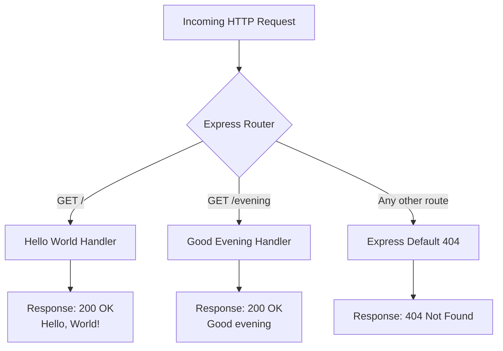

# Technical Specification

# 0. Agent Action Plan

## 0.1 Intent Clarification

### 0.1.1 Core Feature Objective

Based on the prompt, the Blitzy platform understands that the new feature requirement is to:

- **Integrate Express.js into an existing bare-bones Node.js HTTP server** — The current project (`hello_world`) uses the raw Node.js `http` module (`http.createServer()`) in `server.js` to serve a single static response. The user requests replacing or augmenting this with the Express.js framework to gain routing capabilities, middleware support, and a more idiomatic HTTP server structure.

- **Preserve the existing "Hello World" endpoint** — The current server responds with `Hello, World!\n` to every request regardless of method or path. Under Express.js, this behavior must be scoped to a dedicated route (the root path `GET /`) so that the original response is retained and accessible at the expected location.

- **Add a new "Good evening" endpoint** — A second route must be created that returns the response `Good evening` when accessed. This introduces the project's first instance of multi-route HTTP handling, transitioning from a single-response server to a path-differentiated API.

Implicit requirements detected:

- The `server.js` file must be refactored from raw `http.createServer()` to an Express.js application pattern (`const app = express()`) while retaining the same host (`127.0.0.1`) and port (`3000`) configuration.
- `package.json` must be updated to include `express` as a runtime dependency with a proper version specifier.
- `package-lock.json` will be regenerated by npm upon installing Express.js and its transitive dependencies.
- The `main` field in `package.json` currently points to `index.js` (which does not exist) — this discrepancy should be corrected to `server.js` as part of this integration to align the manifest with the actual entry point.
- A `start` script should be added to `package.json` for conventional Express.js project startup (`node server.js`).

### 0.1.2 Special Instructions and Constraints

- **No specific architectural directives** were provided by the user beyond integrating Express.js and adding the endpoint. The implementation should follow standard Express.js conventions.
- **Backward compatibility** — The existing `Hello, World!` response must remain accessible. The user's request is additive ("add another endpoint"), indicating the original behavior must be preserved.
- **Minimal scope** — The user framed this as a tutorial project. Implementation should remain simple and educational, without over-engineering middleware stacks, error handlers, or advanced patterns beyond what is necessary.
- **No test framework specified** — The current `package.json` has a placeholder test script (`echo "Error: no test specified" && exit 1`). No testing requirements were mentioned.
- **No environment variables or secrets** — The user provided no environment configuration. All settings remain hardcoded as constants.

User Example: The user explicitly stated the new endpoint should return `"Good evening"` as its response body.

### 0.1.3 Technical Interpretation

These feature requirements translate to the following technical implementation strategy:

- To **integrate Express.js**, we will install `express` as a runtime dependency via npm and refactor `server.js` from using `http.createServer()` to an Express application instance (`express()`), calling `app.listen()` instead of `server.listen()`.
- To **preserve the Hello World endpoint**, we will create an Express route handler `app.get('/', ...)` that responds with `Hello, World!\n` — matching the current response format exactly.
- To **add the Good evening endpoint**, we will create a new Express route handler `app.get('/evening', ...)` that responds with `Good evening` as plain text.
- To **maintain configuration consistency**, we will keep `hostname = '127.0.0.1'` and `port = 3000` as hardcoded constants and pass them to `app.listen()`.
- To **correct the package manifest**, we will update `package.json` to fix the `main` field from `index.js` to `server.js` and add a `start` script.


## 0.2 Repository Scope Discovery

### 0.2.1 Comprehensive File Analysis

The repository is a minimal, flat-structured Node.js project with exactly four files and zero subdirectories. Every file in the repository is affected by this feature addition.

**Complete Existing File Inventory and Impact Assessment:**

| File | Lines | Current Purpose | Impact | Action Required |
|------|-------|----------------|--------|-----------------|
| `server.js` | 14 | HTTP server using raw `http.createServer()` with static response | **High** — Core refactoring target | MODIFY: Rewrite to use Express.js application pattern with route definitions |
| `package.json` | 11 | npm manifest with zero dependencies, placeholder test, mispointed `main` | **High** — Dependency and metadata changes | MODIFY: Add `express` dependency, fix `main` field, add `start` script |
| `package-lock.json` | 13 | Lock file with empty dependency graph (lockfileVersion 3) | **High** — Automatically regenerated | REGENERATE: npm will regenerate upon `npm install express` |
| `README.md` | 2 | Brief project description with "Do not touch!" directive | **Low** — Documentation update | MODIFY: Update description to reflect Express.js usage and available endpoints |

**Integration Point Discovery:**

- **API endpoints**: The current server has no routing — all requests receive the same response. Express.js introduces proper route handling. Two routes will be registered:
  - `GET /` → returns `Hello, World!\n`
  - `GET /evening` → returns `Good evening`
- **Server initialization**: The `server.listen()` call in `server.js` (lines 12–14) is replaced by `app.listen()` with the same host and port parameters.
- **Module system**: The `require('http')` import (line 1) is replaced by `require('express')`.
- **Database/Schema changes**: None — no database exists in this project.
- **Middleware/Interceptors**: None currently exist; none required for this feature addition.

### 0.2.2 Web Search Research Conducted

- **Express.js latest stable version**: Confirmed via npm registry as `5.2.1`. Express v5 is now the default on npm, having been officially released as stable. It requires Node.js v18 or higher — the project's Node.js v20.20.0 is fully compatible.
- **Express.js basic routing pattern**: Standard `app.get(path, handler)` pattern is used for defining GET route handlers. This is the idiomatic approach for simple endpoint definitions.
- **Express.js migration considerations**: Since this project has zero existing Express code, there are no migration concerns. This is a fresh integration of Express.js into a project that previously used only the raw `http` module.

### 0.2.3 New File Requirements

**New source files to create:**

- No new source files are needed. The feature is implemented entirely through modifications to existing files. The server logic remains in `server.js`, and Express.js integration happens in-place.

**New test files:**

- No test files are required. The user did not specify testing requirements, and the current project has no test infrastructure.

**New configuration files:**

- No new configuration files are required. The project uses hardcoded values and does not require environment files or separate configuration modules.

**Generated files (automatic):**

- `node_modules/` — Created automatically by npm when installing the `express` dependency. Contains Express.js and its transitive dependency tree.


## 0.3 Dependency Inventory

### 0.3.1 Private and Public Packages

The project currently has **zero** npm dependencies. This feature addition introduces Express.js as the sole new runtime dependency.

| Registry | Package Name | Version | Type | Purpose |
|----------|-------------|---------|------|---------|
| npm (public) | `express` | `^5.2.1` | runtime dependency | HTTP framework providing routing, middleware architecture, and request/response handling — replaces raw `http.createServer()` |

**Transitive dependencies**: Express.js v5.2.1 brings a set of transitive dependencies including `body-parser`, `content-disposition`, `cookie`, `debug`, `encodeurl`, `finalhandler`, `merge-descriptors`, `path-to-regexp`, `qs`, `router`, `send`, `serve-static`, and others. These are automatically resolved and locked by npm in `package-lock.json`.

**Version rationale**: Express `5.2.1` is the latest stable release on the npm registry. The caret range `^5.2.1` allows compatible patch and minor updates within the v5 major line. Express v5 requires Node.js v18+, and the project runs Node.js v20.20.0, confirming full compatibility.

### 0.3.2 Dependency Updates

**Import Updates:**

The single file requiring import changes is `server.js`:

| File | Current Import | New Import | Reason |
|------|---------------|------------|--------|
| `server.js` | `const http = require('http');` | `const express = require('express');` | Replace raw `http` module with Express.js framework |

**External Reference Updates:**

| File | Update Type | Details |
|------|------------|---------|
| `package.json` | Add `dependencies` field | Add `"express": "^5.2.1"` to new `dependencies` block |
| `package.json` | Fix `main` field | Change from `"index.js"` to `"server.js"` |
| `package.json` | Add `start` script | Add `"start": "node server.js"` to `scripts` block |
| `package.json` | Update `description` | Reflect Express.js usage in project description |
| `package-lock.json` | Full regeneration | npm regenerates this file with the complete Express.js dependency tree |
| `README.md` | Documentation update | Update to describe Express.js integration and available endpoints |


## 0.4 Integration Analysis

### 0.4.1 Existing Code Touchpoints

**Direct modifications required:**

- **`server.js`** (lines 1–14, full file): The entire file is refactored. The current implementation uses `http.createServer()` with a monolithic callback handler. This is replaced with an Express application instance, explicit route definitions, and `app.listen()`.

  Current flow being replaced:
  ```javascript
  const http = require('http');
  const server = http.createServer((req, res) => { /* single handler */ });
  ```

  New flow:
  ```javascript
  const express = require('express');
  const app = express();
  ```

- **`package.json`** (lines 2–10): Multiple field updates — add `dependencies` block with `express`, fix `main` entry point from `index.js` to `server.js`, add `start` script, and update `description`.

- **`README.md`** (lines 1–2): Update project description to reflect Express.js integration and document the two available endpoints with their expected responses.

**Dependency injections:**

- None — the project has no dependency injection container, service registry, or IoC pattern. Express.js is instantiated directly in `server.js`.

**Database/Schema updates:**

- None — the project has no database, no ORM, no migration system, and no persistent storage of any kind.

### 0.4.2 Integration Flow

The following diagram illustrates how the refactored Express.js server processes requests across the two defined routes:



**Key behavioral change**: Under the current implementation, every request to any path with any method receives `Hello, World!\n`. Under the Express.js implementation, only `GET /` returns `Hello, World!\n`. The new `GET /evening` endpoint returns `Good evening`. All other routes will receive Express.js's default 404 response. This is the expected and intentional behavior of introducing proper routing.


## 0.5 Technical Implementation

### 0.5.1 File-by-File Execution Plan

Every file that must be created or modified is listed below with its specific changes.

**Group 1 — Core Feature Files:**

- **MODIFY: `server.js`** — Refactor the entire file from raw `http` module to Express.js application
  - Remove `require('http')` import and replace with `require('express')`
  - Replace `http.createServer()` with `express()` application instantiation
  - Define `GET /` route handler returning `Hello, World!\n` with status 200 and `text/plain` content type
  - Define `GET /evening` route handler returning `Good evening` with status 200 and `text/plain` content type
  - Replace `server.listen()` with `app.listen()` using the same `hostname` and `port` constants
  - Preserve the console.log startup message format

**Group 2 — Package Configuration:**

- **MODIFY: `package.json`** — Update npm manifest to reflect Express.js integration
  - Add `"dependencies": { "express": "^5.2.1" }` block
  - Change `"main"` from `"index.js"` to `"server.js"` to fix the existing discrepancy
  - Add `"start": "node server.js"` to the `scripts` block
  - Update `"description"` to `"Hello world and Good evening endpoints in Express.js"`

- **REGENERATE: `package-lock.json`** — Automatically regenerated by npm
  - Running `npm install` after updating `package.json` will regenerate this file with the full Express.js dependency tree
  - lockfileVersion 3 format is maintained (npm v7+ compatible)

**Group 3 — Documentation:**

- **MODIFY: `README.md`** — Update project documentation
  - Update the description to reflect Express.js integration
  - Document the two available endpoints (`GET /` and `GET /evening`) with their expected responses
  - Add basic usage instructions (`npm install` and `npm start`)

### 0.5.2 Implementation Approach per File

The implementation follows a bottom-up approach:

- **Step 1 — Establish dependency foundation**: Update `package.json` to declare the `express` dependency, fix the `main` entry point, and add the `start` script. Run `npm install` to populate `node_modules/` and regenerate `package-lock.json`.

- **Step 2 — Refactor core server**: Rewrite `server.js` to replace the raw `http` module with Express.js. Create the Express application instance, define the two route handlers (`GET /` for "Hello, World!" and `GET /evening` for "Good evening"), and bind the server using `app.listen()` with the existing hostname and port constants.

- **Step 3 — Update documentation**: Revise `README.md` to describe the Express.js-powered server and its two endpoints, along with setup and run instructions.

### 0.5.3 User Interface Design

Not applicable — this project is a backend HTTP server with no user interface components. All interactions are via HTTP requests and plain-text responses.


## 0.6 Scope Boundaries

### 0.6.1 Exhaustively In Scope

**All feature source files:**

- `server.js` — Full refactoring from raw `http` module to Express.js with two route handlers

**All configuration files:**

- `package.json` — Add `express` dependency, fix `main` field, add `start` script, update description
- `package-lock.json` — Regenerated automatically by npm with Express.js dependency tree

**Documentation:**

- `README.md` — Updated to reflect Express.js integration and endpoint documentation

**Generated artifacts:**

- `node_modules/**/*` — Express.js and its transitive dependencies, created by `npm install`

**Endpoint definitions:**

| Method | Path | Response Body | Status | Content-Type |
|--------|------|--------------|--------|--------------|
| GET | `/` | `Hello, World!\n` | 200 | text/plain |
| GET | `/evening` | `Good evening` | 200 | text/plain |

### 0.6.2 Explicitly Out of Scope

- **Testing infrastructure** — No test framework, test files, or test scripts will be added. The placeholder `test` script in `package.json` remains unchanged unless updating it is trivial and beneficial.
- **Middleware stack** — No request logging, body parsing, CORS, helmet, or other middleware will be added beyond what Express.js includes by default.
- **Environment-based configuration** — No `.env` files, `dotenv` integration, or environment variable support will be introduced. Hostname and port remain hardcoded constants.
- **Error handling middleware** — No custom Express error handling middleware will be added. Express.js default error handling is sufficient for this tutorial-level project.
- **Additional endpoints** — No endpoints beyond `GET /` and `GET /evening` will be created.
- **TypeScript migration** — The project remains in JavaScript (CommonJS). No TypeScript configuration or type definitions will be added.
- **Containerization or CI/CD** — No Dockerfile, docker-compose, GitHub Actions workflows, or other DevOps artifacts will be created.
- **Performance optimizations** — No clustering, caching, compression, or performance-related middleware will be added.
- **Database or persistent storage** — No database integration of any kind.


## 0.7 Rules for Feature Addition

### 0.7.1 Feature-Specific Rules and Requirements

- **Preserve original response fidelity** — The `GET /` route must return the exact string `Hello, World!\n` (including trailing newline) with `Content-Type: text/plain` and status `200`, matching the original `server.js` behavior byte-for-byte on that specific route.

- **Maintain server binding configuration** — The Express server must listen on `hostname = '127.0.0.1'` and `port = 3000`, preserving the current network configuration exactly. The console startup message must continue to display `Server running at http://127.0.0.1:3000/`.

- **Use CommonJS module system** — The project currently uses CommonJS (`require()`). All new code must use `require()` / `module.exports` syntax. Do not convert to ES Modules (`import` / `export`).

- **Follow Express.js idiomatic patterns** — Route handlers should use the standard `app.get(path, (req, res) => { ... })` pattern. Response sending should use `res.send()` or `res.end()` with explicit content type headers where needed to match the original behavior.

- **Keep implementation minimal** — This is a tutorial-level project. Code should be clear, simple, and self-explanatory. Avoid unnecessary abstractions, helper functions, or complex patterns.

- **Single-file server architecture** — All server logic remains in `server.js`. Do not split routes into separate files or create a multi-file Express application structure. The project's simplicity is intentional.


## 0.8 References

### 0.8.1 Codebase Files and Folders Searched

All files in the repository were retrieved and analyzed during the scope discovery phase:

| File Path | Purpose | Relevance |
|-----------|---------|-----------|
| `server.js` | Main HTTP server implementation (14 lines) — uses raw `http.createServer()` with static `Hello, World!` response | **Primary target** — full refactoring to Express.js |
| `package.json` | npm manifest — `hello_world@1.0.0`, zero dependencies, `main` points to `index.js` (discrepancy) | **Primary target** — dependency and metadata updates |
| `package-lock.json` | Dependency lock file — lockfileVersion 3, empty dependency graph | **Primary target** — regenerated by npm |
| `README.md` | Project description — "hao-backprop-test" with "Do not touch!" directive | **Secondary target** — documentation update |

Root folder structure was confirmed via `get_source_folder_contents` — four files, zero subdirectories.

### 0.8.2 Technical Specification Sections Referenced

| Section | Key Information Extracted |
|---------|-------------------------|
| 1.1 Executive Summary | Project is a minimal "Hello World" Node.js test fixture for Backprop integration |
| 2.1 Feature Catalog | Four features documented: HTTP Server Init, Static Response, Console Logging, Fixture Stability |
| 2.2 Functional Requirements | Detailed requirements for each feature including acceptance criteria |
| 3.1 Stack Overview | Node.js runtime (v15+ inferred), JavaScript CommonJS, npm v7+, zero frameworks |
| 3.3 Frameworks & Libraries | Confirmed zero-framework architecture — no Express, no external libraries |
| 5.2 Component Details | Detailed `server.js` component analysis including startup and request-response sequences |

### 0.8.3 External Research Conducted

| Source | Information Retrieved |
|--------|----------------------|
| npm registry (`npm view express version`) | Express.js latest stable version: `5.2.1` |
| expressjs/express GitHub Releases | Express v5 officially released, requires Node.js v18+, improved async error handling |
| expressjs.com blog (v5.1 release) | Express 5.1.0 is the default on npm with LTS timeline, v4 entering maintenance |
| npm package page (express) | 99,236+ dependents, installation via `npm i express` |

### 0.8.4 Attachments

No attachments were provided for this project. No Figma URLs or design assets are applicable.


