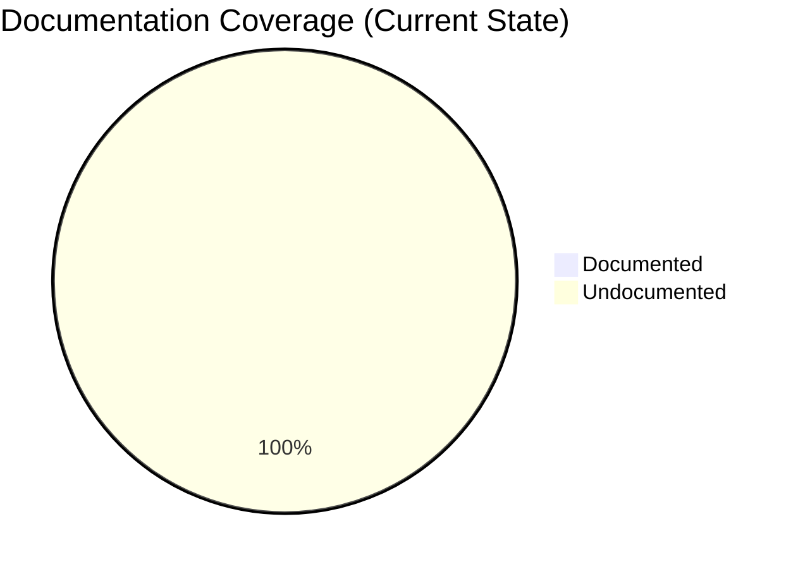
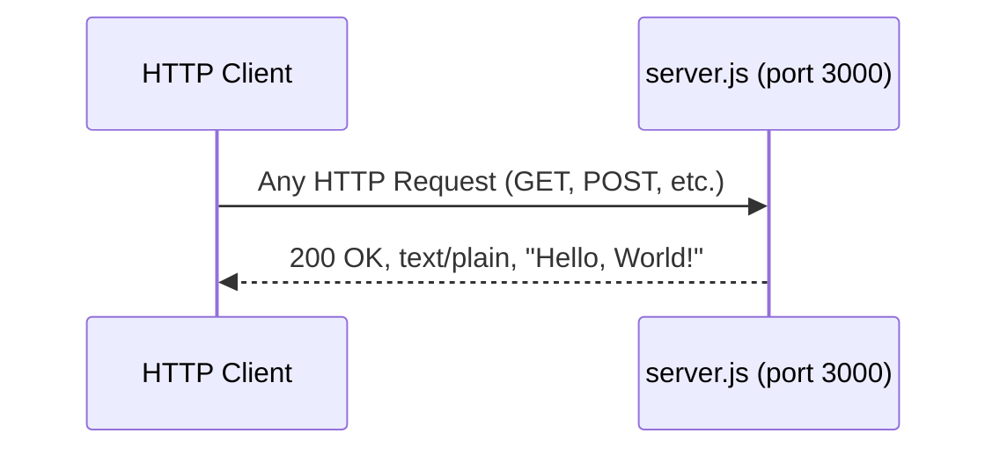

# Technical Specification

# 0. Agent Action Plan

## 0.1 Intent Clarification

### 0.1.1 Core Documentation Objective

Based on the provided requirements, the Blitzy platform understands that the documentation objective is to **comprehensively document a minimal Node.js HTTP server project** (`hello_world` / `hao-backprop-test`) by adding structured JSDoc annotations to the sole application file (`server.js`) and replacing the existing placeholder README with a professional, multi-section README covering setup, API reference, deployment, and code explanations.

**Request Category:** Create new documentation | Update existing documentation

**Documentation Types:**
- **Inline code documentation** — JSDoc comments for `server.js` constants, the request handler callback, and the server startup listener
- **Project README** — Comprehensive `README.md` covering setup instructions, API documentation, deployment guide, and inline code explanations
- **API documentation** — HTTP endpoint specification (method, path, response format, status codes)

**Explicit Documentation Requirements:**

- Add JSDoc comments to all functions and significant code elements in `server.js`
- Create a comprehensive `README.md` containing:
  - Setup instructions (prerequisites, installation, running the server)
  - API documentation (endpoint behavior, request/response specification)
  - Deployment guide (how to deploy and run the server in various environments)
  - Inline code explanations (annotated walkthrough of `server.js` logic)

**Implicit Documentation Needs (surfaced from repository analysis):**

- The existing `README.md` contains only a project title and a warning line — it requires a complete rewrite rather than incremental updates
- `package.json` declares `"main": "index.js"` but the actual entry point is `server.js` — this discrepancy should be documented
- No `npm start` script is defined — the README must clarify that the server is started via `node server.js`
- Zero external dependencies — setup documentation should highlight this simplicity
- The project serves as a Backprop integration test fixture — the README should preserve context about the project's purpose

### 0.1.2 Special Instructions and Constraints

- No user-provided templates, style guides, or formatting constraints were specified
- No environment variables or secrets are required by this project
- No Figma screens or design attachments were provided
- The project uses CommonJS (`require`) syntax — JSDoc annotations must be compatible with this module system
- The project has zero external dependencies — documentation tooling (`jsdoc`) is a development-only addition

### 0.1.3 Technical Interpretation

These documentation requirements translate to the following technical documentation strategy:

- To **add JSDoc comments to server.js**, we will annotate the file with `/** ... */` comment blocks covering:
  - The `@module` declaration for the file itself
  - `@constant` tags for `hostname` and `port`
  - `@callback` documentation for the `http.createServer()` request handler (parameters `req` and `res`)
  - `@function` documentation for the `server.listen()` startup callback
  - Inline explanatory comments for each logical step in the request-response cycle

- To **create a comprehensive README**, we will replace the existing 2-line `README.md` with a structured Markdown document containing:
  - Project overview and purpose
  - Table of contents
  - Prerequisites and setup instructions
  - API endpoint reference table
  - Deployment guide for local and production environments
  - Annotated code walkthrough
  - Project structure description
  - License information

### 0.1.4 Inferred Documentation Needs

- **Based on code analysis:** `server.js` contains zero documentation comments — every constant, callback, and method call requires JSDoc annotation (Source: `server.js`, lines 1–14)
- **Based on structure:** The project is a single-file application; the README must serve as the sole external documentation artifact, consolidating all information into one file (Source: root folder contents — 4 files, 0 subdirectories)
- **Based on dependencies:** Zero external packages means the setup section is minimal, but the deployment guide should cover Node.js runtime requirements (Source: `package.json`, `package-lock.json`)
- **Based on configuration discrepancy:** `package.json` lists `"main": "index.js"` while the actual runnable file is `server.js` — this warrants a note in the README (Source: `package.json`, line 5)

## 0.2 Documentation Discovery and Analysis

### 0.2.1 Existing Documentation Infrastructure Assessment

Repository analysis reveals a **minimal documentation footprint** with a single placeholder `README.md` and zero documentation tooling or infrastructure.

**Search patterns employed:**
- Documentation files matching `README*`, `docs/**`, `*.md`, `*.mdx`, `*.rst`, `wiki/**` — only `README.md` found at root
- Documentation generator configurations (`mkdocs.yml`, `docusaurus.config.js`, `sphinx.conf.py`, `.jsdoc.json`, `jsdoc.json`) — none found
- Existing JSDoc or inline documentation in `server.js` — none found
- Documentation templates or style guides — none found
- CI/CD documentation pipelines — none found

**Current documentation state:**

| Aspect | Status | Details |
|--------|--------|---------|
| README.md | Placeholder only | 2 lines: title (`# hao-backprop-test`) and warning (`test project for backprop integration. Do not touch!`) |
| JSDoc comments | Absent | `server.js` contains zero documentation comments |
| Documentation framework | None | No documentation generator configured |
| API documentation tools | None | No JSDoc, Swagger, or OpenAPI tooling detected |
| Diagram tools | None | No Mermaid, PlantUML, or other diagram tools in use |
| Documentation hosting/deployment | None | No documentation hosting configuration present |

### 0.2.2 Repository Code Analysis for Documentation

**Search patterns used for code to document:**
- Public APIs: `server.js` — single file containing the `http.createServer()` handler with uniform response logic
- Module interfaces: No `index.js` exists (despite `package.json` declaring `"main": "index.js"`) — `server.js` is the de facto entry point
- Configuration options: Hardcoded `hostname` (`127.0.0.1`) and `port` (`3000`) constants in `server.js` lines 3–4
- CLI commands: None — server is started directly via `node server.js`

**Key directories examined:**

| Path | Type | Relevance |
|------|------|-----------|
| `/` (root) | Folder | Contains all 4 project files; no subdirectories |
| `server.js` | File | Sole application logic — HTTP server (14 lines) |
| `package.json` | File | npm manifest — project metadata, no start script |
| `package-lock.json` | File | Lock state — lockfileVersion 3, zero external packages |
| `README.md` | File | Placeholder — requires complete replacement |

**Related documentation found:** None — no existing documentation provides context, templates, or style references for the new documentation.

### 0.2.3 Web Search Research Conducted

- **JSDoc best practices for Node.js:** JSDoc 4.0.5 is the latest stable version; supports CommonJS modules via `@module` tag; standard tags include `@param`, `@returns`, `@constant`, `@callback`, and `@description`
- **README structure conventions:** Best practice for Node.js projects includes project title, description, table of contents, prerequisites, installation, usage, API reference, deployment, and license sections
- **Node.js HTTP server documentation patterns:** Recommend documenting the request handler with `@param {http.IncomingMessage}` and `@param {http.ServerResponse}` types for the callback parameters
- **Inline code commenting strategy:** Best practice emphasizes explaining the "why" over the "how", using JSDoc for function-level documentation and single-line comments for step-by-step logic clarification

## 0.3 Documentation Scope Analysis

### 0.3.1 Code-to-Documentation Mapping

**Modules requiring documentation:**

- **Module: `server.js`** (Source: `server.js`, lines 1–14)
  - Public APIs / Documentable elements:
    - `hostname` constant (`'127.0.0.1'`) — line 3
    - `port` constant (`3000`) — line 4
    - `http.createServer()` request handler callback — lines 6–10
    - `res.statusCode = 200` — line 7
    - `res.setHeader('Content-Type', 'text/plain')` — line 8
    - `res.end('Hello, World!\n')` — line 9
    - `server.listen()` invocation and startup callback — lines 12–14
  - Current documentation: **Missing** — zero JSDoc comments, zero inline comments
  - Documentation needed: File-level `@module` JSDoc, `@constant` tags for `hostname` and `port`, `@callback` for request handler with typed `@param` for `req` and `res`, inline explanatory comments for each server operation step

- **Module: `package.json`** (Source: `package.json`, lines 1–11)
  - Configuration options:
    - `name`: `"hello_world"` — npm package identity
    - `version`: `"1.0.0"` — release version
    - `main`: `"index.js"` — declared entry point (discrepancy: file does not exist)
    - `scripts.test`: placeholder that exits with error code 1
  - Current documentation: **None** — no companion documentation
  - Documentation needed: Configuration explained in README project structure section

**Configuration options requiring documentation:**

| Config File | Option | Documented | Needs Documentation |
|-------------|--------|------------|---------------------|
| `package.json` | `name` | No | Yes — explain in README |
| `package.json` | `version` | No | Yes — mention in README |
| `package.json` | `main` | No | Yes — note discrepancy with `server.js` |
| `package.json` | `scripts.test` | No | Yes — explain placeholder status |
| `server.js` | `hostname` | No | Yes — JSDoc `@constant` |
| `server.js` | `port` | No | Yes — JSDoc `@constant` |

**Features requiring user guides:**

| Feature | Current Coverage | Gaps |
|---------|-----------------|------|
| HTTP Server Initialization | None | Setup guide, prerequisites, startup command |
| Static HTTP Response | None | API endpoint documentation, request/response examples |
| Console Startup Logging | None | Expected output documentation |
| Server Configuration | None | Explanation of hardcoded `hostname` and `port` |

### 0.3.2 Documentation Gap Analysis

Given the requirements and repository analysis, documentation gaps include:

- **Undocumented code elements:** All 7 documentable elements in `server.js` lack JSDoc annotations (0% coverage)
- **Missing README content:** The existing `README.md` contains zero technical documentation — no setup, no API reference, no deployment guide, no code explanation
- **Missing API specification:** The HTTP endpoint (`GET/POST/ANY http://127.0.0.1:3000/`) returns a static response but has no formal documentation
- **Missing project structure guide:** No documentation explains the 4-file layout or the `main: index.js` vs `server.js` discrepancy
- **Missing deployment instructions:** No guide exists for running the server locally or deploying to a production environment
- **Missing inline code explanations:** No code walkthrough exists to explain the purpose and function of each line in `server.js`



## 0.4 Documentation Implementation Design

### 0.4.1 Documentation Structure Planning

Since this is a minimal single-file project with no subdirectories, all documentation will reside at the root level. The documentation structure centers on two deliverables: the annotated `server.js` and the comprehensive `README.md`.

```
/ (project root)
├── README.md              (comprehensive project documentation — CREATE/REPLACE)
├── server.js              (annotated with JSDoc comments and inline explanations — UPDATE)
├── package.json           (unchanged)
└── package-lock.json      (unchanged)
```

**README.md Section Hierarchy:**

```
README.md
├── Project Title & Description
├── Table of Contents
├── Prerequisites
├── Installation & Setup
│   ├── Clone the Repository
│   ├── Install Dependencies
│   └── Verify Installation
├── Usage
│   └── Starting the Server
├── API Documentation
│   ├── Endpoint Overview
│   ├── Request Specification
│   └── Response Specification
├── Code Walkthrough
│   ├── Module Import
│   ├── Server Configuration
│   ├── Request Handler
│   └── Server Startup
├── Deployment Guide
│   ├── Local Development
│   ├── Production Deployment
│   └── Process Management
├── Project Structure
├── Known Issues & Notes
├── Contributing
└── License
```

### 0.4.2 Content Generation Strategy

**Information Extraction Approach:**

- Extract API behavior from `server.js` request handler (lines 6–9): uniform `200 OK` response with `text/plain` content type and `Hello, World!\n` body
- Extract configuration values from `server.js` constants (lines 3–4): `hostname = '127.0.0.1'`, `port = 3000`
- Extract project metadata from `package.json`: name, version, license, author
- Generate JSDoc type annotations using Node.js built-in type definitions: `http.IncomingMessage`, `http.ServerResponse`, `http.Server`

**Documentation Standards:**

- Markdown formatting with proper heading hierarchy (`#`, `##`, `###`)
- Code examples using fenced code blocks with `javascript` and `bash` language specifiers
- Tables for parameter descriptions, response fields, and project structure
- Consistent terminology: "server", "request handler", "endpoint", "response"
- Source citations as inline references: `Source: server.js:Line`

### 0.4.3 Diagram and Visual Strategy

**Mermaid diagrams to include in README.md:**

- **Request-Response Flow Diagram:** Sequence diagram showing an HTTP client sending a request to the server and receiving the static `Hello, World!` response
- **Server Lifecycle Diagram:** Flowchart showing `node server.js` → server binding → ready state → request handling

**Diagrams for server.js JSDoc (inline):**
- No inline diagrams — JSDoc comments will use textual descriptions appropriate for code-level documentation



## 0.5 Documentation File Transformation Mapping

### 0.5.1 File-by-File Documentation Plan

| Target Documentation File | Transformation | Source Code/Docs | Content/Changes |
|---------------------------|----------------|------------------|-----------------|
| `README.md` | UPDATE | `README.md`, `server.js`, `package.json` | Complete replacement of placeholder content with comprehensive project documentation including setup instructions, API docs, deployment guide, code walkthrough, and project structure |
| `server.js` | UPDATE | `server.js` | Add JSDoc comment blocks for the module, constants (`hostname`, `port`), request handler callback (`req`, `res`), and `server.listen()` callback; add inline explanatory comments for each operational step |

### 0.5.2 New / Updated Documentation Files Detail

**File: `README.md`**
- Type: Comprehensive Project Documentation (UPDATE — full content replacement)
- Source Code: `server.js` (lines 1–14), `package.json` (lines 1–11)
- Sections:
  - **Project Title & Description** — purpose as a Hello World Node.js HTTP server
  - **Table of Contents** — linked section navigation
  - **Prerequisites** — Node.js v15+ runtime requirement
  - **Installation & Setup** — git clone, npm install, verification steps
  - **Usage** — `node server.js` command, expected console output
  - **API Documentation** — endpoint table: method (ANY), path (ANY), status (200), content type (`text/plain`), body (`Hello, World!\n`)
  - **Code Walkthrough** — annotated explanation of each section of `server.js`
  - **Deployment Guide** — local development, production with process managers (PM2, systemd), Docker considerations
  - **Project Structure** — file listing with purpose descriptions
  - **Known Issues & Notes** — `main: index.js` discrepancy, no `npm start` script, placeholder test script
  - **Contributing** — contribution guidelines
  - **License** — MIT license reference from `package.json`
- Diagrams:
  - Request-response sequence diagram (Mermaid)
  - Server lifecycle flowchart (Mermaid)
- Key Citations: `server.js`, `package.json`, `package-lock.json`

**File: `server.js`**
- Type: Inline Code Documentation (UPDATE — add JSDoc and inline comments)
- Source Code: `server.js` (existing 14 lines, annotations added around them)
- JSDoc Annotations to Add:
  - **File-level `@module` block** — `@module server`, `@description`, `@author`, `@license`, `@requires http`
  - **`hostname` constant** — `@constant {string}`, `@default '127.0.0.1'`
  - **`port` constant** — `@constant {number}`, `@default 3000`
  - **Request handler callback** — `@param {http.IncomingMessage} req`, `@param {http.ServerResponse} res`, `@description`
  - **`server.listen()` callback** — inline comment explaining startup confirmation logging
- Inline Comments to Add:
  - Comment above `require('http')` explaining the built-in module import
  - Comment above server configuration constants explaining their purpose
  - Comments within the request handler explaining each response step (status code, header, body)
  - Comment above `server.listen()` explaining the binding and startup sequence
- Key Citations: Node.js `http` module API (built-in)

### 0.5.3 Documentation Configuration Updates

No documentation configuration files require creation or modification. The project does not use any documentation generator framework (no `mkdocs.yml`, `docusaurus.config.js`, `.readthedocs.yml`, or `jsdoc.json`). Documentation is delivered entirely through Markdown (`README.md`) and inline JSDoc comments (`server.js`).

If JSDoc HTML generation is desired in the future, a `jsdoc.json` configuration file and `package.json` script entry would need to be added — but this is **out of scope** for the current task, which focuses on inline JSDoc comments and the README.

### 0.5.4 Cross-Documentation Dependencies

| Dependency | From | To | Type |
|------------|------|----|------|
| Code walkthrough accuracy | `server.js` JSDoc comments | `README.md` Code Walkthrough section | Content must be consistent |
| API documentation accuracy | `server.js` request handler (lines 6–9) | `README.md` API Documentation section | Endpoint behavior must match |
| Configuration reference | `server.js` constants (lines 3–4) | `README.md` Usage section | Port and hostname values must agree |
| Project metadata | `package.json` fields | `README.md` License and Project Structure sections | Name, version, license must match |

- No shared content/includes between files
- No navigation links between documents (single README)
- No table of contents or index updates in external files
- No glossary updates needed

## 0.6 Dependency Inventory

### 0.6.1 Documentation Dependencies

The project currently has **zero** runtime or development dependencies. The documentation task requires only the JSDoc tool as a development dependency for potential HTML documentation generation, though the primary deliverable is inline JSDoc comments that require no tooling to use.

| Registry | Package Name | Version | Purpose |
|----------|--------------|---------|---------|
| npm | jsdoc | 4.0.5 | JSDoc documentation generator for generating HTML API docs from annotated `server.js` (optional — inline comments work without this package) |

**Runtime Dependencies:** None — the project uses only Node.js built-in modules (`http`, `console`).

**Project Dependencies from `package.json`:**

| Section | Count | Details |
|---------|-------|---------|
| `dependencies` | 0 | No runtime dependencies declared |
| `devDependencies` | 0 | No development dependencies declared |
| `peerDependencies` | 0 | Not declared |

**Runtime Requirements:**

| Requirement | Version | Source Evidence |
|-------------|---------|----------------|
| Node.js | v15+ (inferred from `package-lock.json` lockfileVersion 3 requiring npm v7+) | `package-lock.json`, line 4 |
| npm | v7+ | `package-lock.json`, lockfileVersion 3 |

### 0.6.2 Documentation Reference Updates

No documentation link updates are required, as the project currently contains no internal or external documentation links. The new `README.md` will establish the initial link structure with internal section anchors (table of contents) only.

| Update Type | Current State | Action |
|-------------|---------------|--------|
| Internal README links | None exist | Create table of contents with anchor links |
| External documentation links | None exist | No action required |
| Cross-file references | None exist | No action required |

## 0.7 Coverage and Quality Targets

### 0.7.1 Documentation Coverage Metrics

**Current coverage analysis:**

| Category | Documented | Total | Coverage |
|----------|-----------|-------|----------|
| Public APIs (HTTP endpoints) | 0 | 1 | 0% |
| Code elements with JSDoc | 0 | 5 | 0% |
| Configuration options documented | 0 | 6 | 0% |
| User-facing features documented | 0 | 4 | 0% |
| README sections complete | 0 | 12 | 0% |

**Target coverage: 100%** — based on the user requirement for "comprehensive" documentation and the small project scope making full coverage achievable.

**Coverage gaps to address:**

| Element | Current | Target | Gap |
|---------|---------|--------|-----|
| `server.js` JSDoc annotations | 0% | 100% | All 5 documentable elements (module, 2 constants, request handler, listen callback) |
| `README.md` sections | 0% | 100% | All 12 planned sections (title, TOC, prerequisites, setup, usage, API, walkthrough, deployment, structure, notes, contributing, license) |
| HTTP endpoint documentation | 0% | 100% | Full request/response specification |
| Inline code explanations | 0% | 100% | Explanatory comments for every logical code block in `server.js` |

### 0.7.2 Documentation Quality Criteria

**Completeness requirements:**
- All documentable elements in `server.js` have JSDoc blocks with `@description`, type annotations (`@constant`, `@param`, `@returns`), and default values
- README includes setup instructions that enable a new developer to run the server from a fresh clone in under 2 minutes
- API documentation includes the full request/response specification with examples
- Deployment guide covers at least local development and basic production scenarios
- Code walkthrough explains the purpose and function of every significant line in `server.js`

**Accuracy validation:**
- All code examples in the README must reflect the actual `server.js` content (lines 1–14)
- JSDoc type annotations must use correct Node.js built-in types: `http.IncomingMessage`, `http.ServerResponse`, `http.Server`
- Port number (`3000`), hostname (`127.0.0.1`), response body (`Hello, World!\n`), and status code (`200`) must be accurately reflected
- `curl` examples must produce the documented output when run against the actual server

**Clarity standards:**
- Technical accuracy with accessible language suitable for developers of all experience levels
- Progressive disclosure: quick start before deep dive, overview before details
- Consistent terminology: "server", "request handler", "endpoint", "response" used throughout
- JSDoc comments must be concise yet informative — avoid verbose descriptions for simple operations

**Maintainability:**
- Source citations reference specific file paths and line numbers
- README structure uses standard Markdown with clear heading hierarchy
- JSDoc follows official JSDoc 4.x syntax conventions for forward compatibility

### 0.7.3 Example and Diagram Requirements

| Requirement | Minimum Count | Type |
|-------------|---------------|------|
| Code examples in README | 3 | Bash (running server, curl command, expected output) |
| Mermaid diagrams in README | 2 | Sequence diagram (request-response), Flowchart (server lifecycle) |
| JSDoc annotations in server.js | 5 | Module, hostname, port, request handler, listen callback |
| Inline comments in server.js | 4 | One per logical code block (import, config, handler, startup) |

**Code example verification:** All bash commands and expected outputs documented in the README should be verifiable by running `node server.js` and executing `curl http://127.0.0.1:3000/` against the live server.

## 0.8 Scope Boundaries

### 0.8.1 Exhaustively In Scope

**Documentation file updates:**
- `README.md` — Complete replacement of placeholder content with comprehensive project documentation
- `server.js` — Addition of JSDoc comment blocks and inline explanatory comments (documentation-only changes; application logic remains unchanged)

**Documentation content areas:**
- JSDoc annotations for all `server.js` code elements (module declaration, constants, callbacks)
- Setup and installation instructions
- API endpoint documentation (request/response specification)
- Deployment guide (local and production environments)
- Inline code explanations and annotated walkthrough
- Project structure documentation
- Known issues and configuration discrepancy notes
- License and contribution information

**Documentation assets (embedded within README.md):**
- Mermaid sequence diagram for request-response flow
- Mermaid flowchart for server lifecycle
- Fenced code blocks with syntax-highlighted examples

### 0.8.2 Explicitly Out of Scope

- **Source code logic modifications** — No changes to `server.js` application behavior (no new routes, middleware, error handling, or functional changes)
- **package.json modifications** — No changes to project metadata, scripts, or dependencies (the `"main": "index.js"` discrepancy will be documented but not fixed)
- **package-lock.json modifications** — No changes to the lock file
- **New file creation beyond README.md** — No `docs/` directory, no separate API specification files, no `CONTRIBUTING.md`, no `CHANGELOG.md`
- **Documentation generator configuration** — No `jsdoc.json`, `mkdocs.yml`, or similar configuration files will be created
- **Test file modifications** — No test documentation or test file changes
- **Deployment configuration files** — No `Dockerfile`, `docker-compose.yml`, `PM2 ecosystem.config.js`, or CI/CD pipeline files
- **External documentation hosting** — No GitHub Pages, ReadTheDocs, or Netlify deployment
- **Feature additions or code refactoring** — No functional changes to the server
- **Installation of new npm dependencies** — JSDoc is documented as an optional reference; no package installation is performed

## 0.9 Execution Parameters

### 0.9.1 Documentation-Specific Instructions

| Parameter | Value |
|-----------|-------|
| Documentation build command | N/A — no documentation generator is configured; inline JSDoc and Markdown are the deliverables |
| Documentation preview command | Any Markdown viewer or `cat README.md`; for JSDoc HTML (optional): `npx jsdoc server.js -d docs/` |
| Diagram generation command | N/A — Mermaid diagrams are embedded as fenced code blocks in Markdown and render natively on GitHub |
| Documentation deployment command | N/A — no documentation hosting configured |
| Default format | Markdown (`.md`) for README; JSDoc comment syntax (`/** */`) for inline code documentation |
| Citation requirement | Every technical claim in the README must reference the source file and line number |
| Style guide | Standard JSDoc 4.x tag conventions; GitHub Flavored Markdown (GFM) for README |
| Documentation validation | Manual review — verify JSDoc syntax with `npx jsdoc server.js --explain` (optional), verify Markdown rendering on GitHub |

### 0.9.2 Server Verification Commands

To validate that documentation accurately reflects server behavior:

```bash
node server.js &
curl -i http://127.0.0.1:3000/
kill %1
```

Expected output from `curl`:
```
HTTP/1.1 200 OK
Content-Type: text/plain
Hello, World!
```

These commands can be used to verify all API documentation examples in the README.

## 0.10 Rules for Documentation

No user-specified documentation rules or constraints were provided. The following standard documentation practices apply based on the project context and best-practice research:

- **Preserve application logic:** JSDoc comments and inline explanations must be added to `server.js` without altering any executable code — no lines of application logic may be added, removed, or modified
- **Accurate source citations:** All technical details in the README must reference specific source files and line numbers (e.g., `Source: server.js:3`)
- **Use standard JSDoc 4.x tags:** All JSDoc annotations must use officially supported tags (`@module`, `@constant`, `@param`, `@returns`, `@description`, `@author`, `@license`, `@requires`, `@default`)
- **Use correct Node.js built-in types:** JSDoc type annotations must reference the actual Node.js type names (`http.IncomingMessage`, `http.ServerResponse`, `http.Server`, `string`, `number`)
- **GitHub Flavored Markdown:** The README must use GFM-compatible syntax, including fenced code blocks, tables, and Mermaid diagram blocks
- **Comprehensive but concise:** Documentation should be thorough enough for a new developer to understand and run the project, while avoiding unnecessary verbosity for a 14-line application
- **No assumptions beyond evidence:** Documentation must only describe behavior observable in the source code — no inferred features, speculative functionality, or aspirational descriptions

## 0.11 References

### 0.11.1 Repository Files and Folders Searched

| Path | Type | Purpose of Search | Key Finding |
|------|------|-------------------|-------------|
| `/` (root) | Folder | Enumerate all project files and identify documentation structure | 4 files, 0 subdirectories; minimal project scaffold |
| `server.js` | File | Analyze application code requiring JSDoc annotations and documentation | 14-line HTTP server using `http.createServer()`, zero existing comments |
| `package.json` | File | Extract project metadata and identify dependency manifests | `hello_world` v1.0.0, MIT license, zero dependencies, `main: index.js` discrepancy |
| `package-lock.json` | File | Verify dependency state and Node.js version requirements | lockfileVersion 3 (npm v7+), zero external packages |
| `README.md` | File | Assess existing documentation state | 2-line placeholder: title and warning message only |

### 0.11.2 Technical Specification Sections Referenced

| Section | Purpose |
|---------|---------|
| 1.1 Executive Summary | Project overview, immutability contract, stakeholder identification |
| 1.2 System Overview | System context, component listing, success criteria, and KPIs |
| 2.1 Feature Catalog | Feature definitions (F-001 through F-004) for HTTP server, static response, logging, and stability |
| 3.1 Stack Overview | Technology stack details: Node.js v15+, CommonJS, `http` built-in module, npm v7+ |
| 5.2 Component Details | Detailed `server.js` component analysis: startup sequence, request-response cycle, state model, `package.json` configuration |

### 0.11.3 External Research Sources

| Source | Topic | Key Insight |
|--------|-------|-------------|
| npmjs.com/package/jsdoc | JSDoc latest version | v4.0.5 is the latest stable release; supports Node.js 12.0.0+ |
| jsdoc.app | JSDoc official documentation | Standard tags for CommonJS modules; `@module`, `@param`, `@returns`, `@constant` syntax |
| Node.js best practices (goldbergyoni/nodebestpractices) | Documentation patterns | JSDoc for in-code comments, structured README with clear sections |
| w3tutorials.net | JSDoc in Node.js guide | JSDoc annotation best practices: describe purpose, parameters, return types |
| gomakethings.com | JavaScript documentation strategy | JSDoc for function overviews; inline comments for step-by-step logic; hand-write README |
| daily.dev | Commenting JavaScript effectively | Explain "why" over "how"; use JSDoc for functions, single-line for logic |

### 0.11.4 Attachments and External Assets

- **Figma screens provided:** None
- **User-uploaded attachments:** None
- **Environment files:** None
- **User-provided templates:** None
- **User-specified implementation rules:** None

